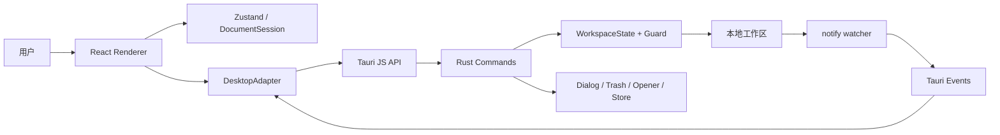
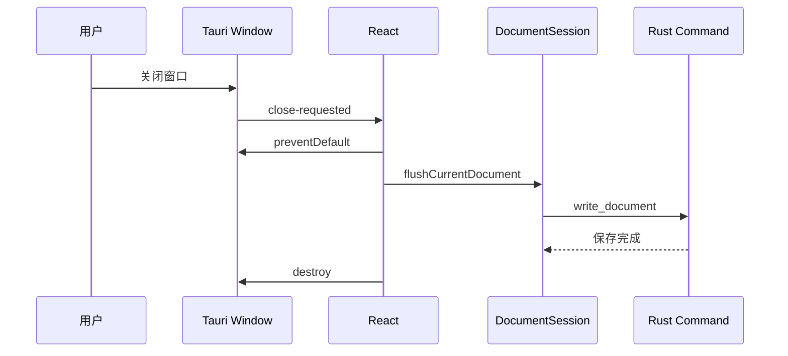

# md-manage：Electron → Tauri 迁移技术方案

> 文档状态：已实施，风险项持续收敛
>
> 目标分支：`feature/tauri-migration`
>
> 技术基线：Tauri 2、React 18、TypeScript、Vite 5、Rust stable
>
> 最后更新：2026-08-03
>
> 现状依据：[技术架构文档](./技术架构文档.md)

## 实施状态（2026-08-03）

方案主体已在 `feature/tauri-migration` 落地：Electron main/preload/IPC 与 electron-builder 已移除；React Renderer 通过 DesktopAPI 调用 Tauri；文件、工作区守卫、图片、导入、配置和 watcher 已迁移到 Rust；macOS ARM64 二进制、`.app` 和 `.dmg` 已成功构建。

已完成：

- Tauri 2 工程、capability、CSP、图标与打包配置；
- Rust WorkspaceGuard、文件 CRUD、废纸篓、图片保存、导入、HTML 导出和稳定错误码；
- Rust `notify` watcher 与 Tauri event；
- `md-manage-resource://` 受控图片协议；
- Renderer DesktopAPI、原生 dialog/menu/opener/window 适配；
- 保存队列与 close-request flush/destroy 握手；
- 旧 Electron 工作区配置的只读导入；
- TypeScript、Vitest、Cargo test、Clippy、Web build 与 macOS bundle 验证。

仍有以下显式风险：

| ID | 等级 | 状态 |
|---|---|---|
| `RISK-TAURI-PDF` | 高 | 采用系统打印降级，尚无跨平台直接 PDF 文件生成 |
| `RISK-CROSS-PLATFORM` | 高 | Windows/Linux 尚未真实编译安装与全流程验收 |
| `RISK-SAVE-CONFLICT` | 高 | 外部修改冲突和跨平台原子替换尚未实现 |
| `RISK-E2E` | 中 | 缺少自动化桌面全流程测试 |
| `RISK-CONFIG-MIGRATION` | 中 | 旧配置迁移尚未三平台验证 |
| `RISK-WATCHER` | 中 | 高频事件尚未 debounce，仍会触发全树刷新 |
| `RISK-SIGNING` | 中 | 发布签名、公证和自动更新尚未配置 |

下文保留原始目标与分阶段方案，用作实施追溯；当前真实架构以[技术架构文档](./技术架构文档.md)为准。

## 1. 结论与推荐方案

建议迁移到 Tauri 2，但采用“保持 Renderer、替换桌面运行时”的渐进式方案，不建议同时重写 React、编辑器或状态管理。

迁移的主要收益是：

- 不再随应用分发完整 Chromium，安装包和基础内存占用通常明显下降；
- 文件权限、命令调用和本地资源读取可以通过 Tauri capability 与 Rust 类型系统收紧；
- 移除 Electron 当前的 `sandbox: false`、`webSecurity: false` 和 `file://` 本地图片方案；
- 文件系统、路径守卫和监听器集中到 Rust，适合后续增加原子写入与外部修改冲突检测。

迁移不是简单替换依赖。以下能力必须重写或重新设计：

- Electron main、preload 和全部 IPC handler；
- 工作区路径守卫与文件 CRUD；
- chokidar 文件监听；
- 窗口状态和关闭前保存握手；
- 原生右键菜单、废纸篓、导入导出；
- 本地图片资源协议；
- electron-builder 打包、CI 和发布流程。

其中 **PDF 导出** 是最大功能差异：Tauri 使用系统 WebView，没有 Electron `webContents.printToPDF()` 的统一等价接口。迁移前必须确定产品接受“系统打印为 PDF”，还是引入独立 PDF 引擎。

## 2. 迁移目标与非目标

### 2.1 目标

1. `.md`、`.markdown`、目录与图片数据完全兼容，用户无需迁移工作区。
2. 保持编辑、阅读、搜索、自动保存、图片预览和文件管理的用户体验。
3. 所有文件命令均限制在当前工作区，拒绝 `..`、绝对路径替换和符号链接越界。
4. 保留保存队列以及切换文件、工作区和关闭窗口前的 flush 语义。
5. 使用 Tauri 2 capability 最小化前端权限。
6. 建立可自动验证的 Rust 单元测试、前端单元测试与桌面端冒烟测试。
7. 最终删除 Electron 依赖、`electron/` 目录和 electron-builder 配置。

### 2.2 非目标

- 不重写 React、Zustand、CodeMirror 或 unified Markdown 管道。
- 不在本次迁移中增加云同步、数据库或账号系统。
- 不改变工作区 `.md-manage/images/` 的数据格式。
- 不把所有文件操作直接交给前端的通用 filesystem 插件。
- 不同时实施大型 UI 改版；UI 调整应另开需求。

## 3. 当前架构影响分析

### 3.1 可直接保留

| 模块 | 处理方式 |
|---|---|
| React 组件与 CSS | 保留，替换桌面 API 调用 |
| CodeMirror 编辑器 | 保留 |
| Zustand Store | 保留，调整工作区配置来源 |
| `documentSession.ts` | 保留队列设计，依赖平台适配器 |
| Front Matter、字数、快捷键 | 保留 |
| unified/remark/rehype | 保留，替换本地图片 URL 生成方式 |
| Vitest 单元测试 | 保留并扩展 |

### 3.2 必须替换

| Electron 实现 | Tauri 目标实现 |
|---|---|
| `electron/main.ts` | `src-tauri/src/lib.rs`、`main.rs`、Tauri Builder |
| `electron/preload.ts` | TypeScript 平台适配器 + `invoke` / `listen` |
| `ipcMain.handle` | `#[tauri::command]` Rust 命令 |
| `webContents.send` | Tauri event emit/listen |
| `BrowserWindow` | Tauri `WebviewWindow` / JS Window API |
| `dialog` | Tauri dialog plugin或 Rust dialog API |
| `shell.trashItem` | Rust `trash` crate封装命令 |
| `shell.openExternal` | opener plugin，限制 URL scheme |
| `chokidar` | Rust `notify` crate |
| `userData/config.json` | Tauri app config directory下的类型化配置 |
| `webContents.printToPDF` | 系统打印或独立 PDF 方案 |
| `electron-builder` | Tauri bundler |

### 3.3 当前调用面

Renderer 目前依赖 `window.electronAPI` 的 8 个命名空间与 3 类事件：

- `file`：read、write、delete、rename、move、list、create、createFolder；
- `workspace`：open、get、init；
- `config`：get、set；
- `image`：save、getAbsPath；
- `export`：pdf、html；
- `import`：files、folder、drop；
- `contextMenu`：show；
- `window`：窗口操作与关闭确认；
- `file:changed`、`menu:action`、`app:before-close` 事件。

迁移应先稳定这些业务语义，再更换底层实现，避免让 Tauri API 散落到每个组件。

## 4. 目标架构



### 4.1 核心原则

- **业务 API 稳定**：组件依赖 `DesktopAdapter`，而不是直接依赖 `@tauri-apps/api`。
- **路径只在 Rust 侧授权**：前端传入的路径永远视为不可信输入。
- **工作区是状态，不是全局权限**：当前工作区由 Rust `State` 持有，所有命令基于同一状态校验。
- **命令粒度面向业务**：暴露 `read_document`、`move_entry` 等命令，不开放任意文件读写能力。
- **资源访问与文件写入共用同一守卫**：图片预览不能绕过工作区边界。

## 5. 建议目录结构

```text
md-manage/
├── src/
│   ├── platform/
│   │   ├── desktop.ts             # 业务接口定义与统一入口
│   │   ├── tauri.ts               # invoke/listen/window/dialog 适配
│   │   └── errors.ts              # 错误码归一化
│   ├── services/
│   │   └── documentSession.ts     # 继续使用 desktop.file.write/read
│   └── ...                        # 现有 React 代码
├── src-tauri/
│   ├── capabilities/
│   │   └── default.json           # 最小权限集合
│   ├── src/
│   │   ├── commands/
│   │   │   ├── file.rs
│   │   │   ├── workspace.rs
│   │   │   ├── image.rs
│   │   │   ├── import.rs
│   │   │   ├── export.rs
│   │   │   ├── config.rs
│   │   │   └── window.rs
│   │   ├── services/
│   │   │   ├── workspace_guard.rs
│   │   │   ├── watcher.rs
│   │   │   └── atomic_write.rs
│   │   ├── error.rs
│   │   ├── state.rs
│   │   ├── lib.rs
│   │   └── main.rs
│   ├── Cargo.toml
│   ├── tauri.conf.json
│   └── build.rs
├── tests/
│   ├── unit/                       # 现有 TypeScript 测试
│   └── e2e/                        # 桌面冒烟测试
└── document/
```

迁移完成后删除：`electron/`、`electron-builder.yml`、Electron Vite plugin 配置和 Electron 专用类型。

## 6. TypeScript 平台适配层

不要把 `window.electronAPI` 机械替换成全项目的 `invoke()`。先定义稳定接口：

```ts
export interface DesktopAdapter {
  file: {
    read(path: string): Promise<string>;
    write(path: string, content: string): Promise<void>;
    delete(path: string): Promise<void>;
    rename(path: string, newName: string): Promise<string>;
    move(path: string, destination: string): Promise<string>;
    list(path: string): Promise<FileNode[]>;
    create(path: string, name: string): Promise<string>;
    createFolder(path: string, name: string): Promise<string>;
  };
  workspace: {
    open(): Promise<string | null>;
    get(): Promise<string | null>;
  };
  events: {
    onFileChanged(handler: (event: FileChangeEvent) => void): Promise<Unlisten>;
  };
}
```

Tauri 实现集中调用：

```ts
import { invoke } from '@tauri-apps/api/core';

export const tauriDesktop: DesktopAdapter = {
  file: {
    read: (path) => invoke('read_document', { path }),
    write: (path, content) => invoke('write_document', { path, content }),
    // ...
  },
  // ...
};
```

这样 `documentSession.ts`、Sidebar、Editor 和 Settings 只发生一次依赖切换，命令名称或插件变更不会继续扩散。

## 7. Rust 命令层设计

### 7.1 共享状态

```rust
pub struct AppState {
    pub workspace: RwLock<Option<Workspace>>,
    pub watcher: Mutex<Option<WorkspaceWatcher>>,
    pub close_approved: AtomicBool,
}

pub struct Workspace {
    pub configured_root: PathBuf,
    pub canonical_root: PathBuf,
}
```

选择或恢复工作区时，一次性保存词法路径与 canonical root。命令执行时不能信任前端缓存的 workspace。

### 7.2 命令清单

| Rust 命令 | 输入 | 输出 | 关键约束 |
|---|---|---|---|
| `get_workspace` | 无 | 可选路径 | 从类型化配置恢复 |
| `select_workspace` | 无 | 可选路径 | 系统目录选择器、初始化图片目录、重启监听 |
| `list_entries` | 目录路径 | `Vec<FileNode>` | 仅 Markdown 与非隐藏目录 |
| `read_document` | 文件路径 | 内容 + 可选版本 | 工作区内、扩展名校验 |
| `write_document` | 文件路径、内容、可选版本 | 新版本 | 原子写入、冲突检测 |
| `create_document` | 目录、名称 | 新路径 | 独占创建、不覆盖 |
| `create_folder` | 目录、名称 | 新路径 | 名称校验 |
| `rename_entry` | 路径、新名称 | 新路径 | 不覆盖、不可越界 |
| `move_entry` | 源、目标目录 | 新路径 | 不移入自身、不覆盖 |
| `trash_entry` | 路径 | 无 | 只进废纸篓 |
| `save_image` | 字节、扩展名 | 相对路径 | 扩展名与大小限制、UUID 命名 |
| `import_files` | 目标目录 | 导入路径列表 | dialog + 冲突后缀 |
| `import_folder` | 目标目录 | 导入路径列表 | 只复制 Markdown |
| `export_html` | HTML | 可选输出路径 | save dialog、UTF-8 |
| `reveal_in_folder` | 路径 | 无 | 工作区校验后调用 opener |

### 7.3 统一错误模型

Rust 不应把平台错误文本直接暴露给 UI。建议序列化稳定错误码：

```rust
#[derive(Debug, Serialize)]
#[serde(tag = "code", content = "details")]
pub enum AppError {
    NoWorkspace,
    OutsideWorkspace,
    InvalidName,
    AlreadyExists { path: String },
    InvalidMove,
    ExternalModification,
    Io { message: String },
}
```

TypeScript 适配层将 Tauri invoke rejection 转换为 `DesktopError`，UI 根据 code 展示中文提示。日志保留底层原因，用户提示不泄露无关系统路径。

## 8. 工作区安全模型

### 8.1 路径校验算法

每个路径相关命令执行以下流程：

1. 读取 Rust `AppState` 中的当前工作区；
2. 拒绝空路径和包含 NUL 的输入；
3. 将输入转为绝对规范路径，不允许前端替换 root；
4. 对已存在目标执行 `canonicalize()`；
5. 对待创建目标向上查找最近存在父目录并 canonicalize；
6. 检查 canonical path 是否以 canonical workspace root 开头；
7. 对 rename/move 的源和目标分别检查；
8. 执行操作前再次检查目标冲突。

Rust `Path::starts_with` 应作用于规范化后的路径组件，不使用字符串前缀比较。

### 8.2 Tauri capability

前端只获得窗口、事件、对话框等必要权限。不要为任意用户工作区配置 `$HOME/**` 或 `/**` 的通用 filesystem scope；文件读写通过自定义命令和 `WorkspaceGuard` 完成。

建议默认 capability 只包含：

- 主窗口基础控制；
- 接收应用事件；
- 工作区与导出所需的 dialog；
- 受限制的 opener；
- 自定义 Rust 命令。

具体 capability 标识应在锁定 Tauri 2 小版本后按官方 schema 生成和校验，不手工复制过时权限名。

## 9. 本地图片与资源协议

### 9.1 不推荐方案

- 不继续生成 `file://` URL；
- 不为了任意工作区图片而开放全磁盘 asset scope；
- 不把绝对路径直接拼入可被页面任意构造的 URL；
- 不长期把图片全部转换为 base64 data URL，避免大文档的内存和渲染开销。

### 9.2 推荐方案：受控自定义协议

注册 `md-manage-resource://` 自定义协议。Markdown 渲染器只生成包含工作区内相对路径或短期资源标识的 URL：

```text
md-manage-resource://workspace/docs/images/chart.png
```

协议处理器必须：

1. URL 解码一次并拒绝非法编码；
2. 根据当前 Markdown 目录处理普通相对路径；
3. 根据工作区根处理 `.md-manage/images/...`；
4. 调用与文件命令相同的 `WorkspaceGuard`；
5. 限制 MIME 类型为支持的图片格式；
6. 返回正确的 `Content-Type`、长度和缓存策略；
7. 拒绝工作区外、符号链接逃逸、目录和超大文件。

保留当前路径语义：

| Markdown 路径 | Tauri 解析基准 |
|---|---|
| `images/a.png`、`./images/a.png` | 当前 Markdown 文件目录 |
| `../assets/a.png` | 当前文件目录，最终仍须在工作区内 |
| `.md-manage/images/a.png` | 工作区根目录 |
| `https://...`、`data:...` | 维持现有 sanitize 策略 |

完成后从 sanitize schema 移除 `file` 协议，只允许新的受控 scheme。

## 10. 文件监听与外部修改

使用 Rust `notify` crate 替代 chokidar，并由 `WatcherService` 持有 watcher 生命周期：

1. 工作区切换时停止旧 watcher；
2. 监听 Markdown 文件与目录事件，忽略隐藏目录、`.md-manage` 图片变化和构建目录；
3. 对短时间连续事件做 200–300 ms debounce；
4. 统一为 `FileChangeEvent { kind, path }`；
5. 通过 Tauri event 向主窗口发送 `workspace:file-changed`；
6. 窗口销毁或应用退出时释放 watcher。

建议在迁移时补齐外部修改冲突：`read_document` 返回 mtime、size 或内容 hash 作为版本；`write_document` 带 expected version，版本不匹配时返回 `ExternalModification`，禁止静默覆盖。

文件保存采用同目录临时文件、flush/sync 和原子 rename。原子替换的具体行为需分别验证 APFS、NTFS 和常见 Linux 文件系统。

## 11. 窗口、关闭握手与菜单

### 11.1 关闭前保存

Renderer 监听 Tauri close request：



必须区分 `close()` 和 `destroy()`，避免保存成功后再次触发 close handler 形成递归。保存失败时保留窗口并提供“重试 / 放弃更改并退出”。

### 11.2 窗口状态

保存并恢复：位置、尺寸、最大化和全屏。恢复前需要检查显示器边界，防止外接屏移除后窗口出现在不可见区域。可使用维护良好的 window-state 插件，也可在 Rust 中保存类型化状态；无论采用哪种方式，都需要三平台验证。

### 11.3 右键菜单

推荐文件树右键菜单改为 React 自定义菜单，操作仍调用 Rust 命令；剪切、复制、粘贴可保留 WebView 默认行为。原因是当前菜单内容简单，自定义 UI 更容易保持跨平台一致并减少“Rust 菜单事件 → Renderer”回传链路。

若产品要求原生菜单，再使用 Tauri Menu API，并统一注册和释放事件监听。

## 12. 导入、删除与导出

### 12.1 导入

dialog 仅负责选择来源；复制逻辑放在 Rust 命令中。来源可以在工作区外，目标必须在工作区内。目录导入只收集 Markdown，保留相对目录结构，同名冲突延续 `_1`、`_2` 规则。

拖入外部文件时使用 Tauri drag-drop 事件提供的路径，不依赖浏览器 `File.path`。收到路径后仍由 Rust 验证类型并复制。

### 12.2 删除

使用跨平台 `trash` crate 或经过验证的 Tauri 插件移入系统废纸篓。废纸篓失败时返回错误，绝不自动降级为永久删除。

### 12.3 HTML 导出

保持现有 `wrapHtmlForExport()`，通过 save dialog 获取目标，再由 Rust 写入 UTF-8 HTML。导出路径由用户明确选择，不受工作区边界限制，但只允许当前 dialog 返回的单次路径。

### 12.4 PDF 导出决策

| 方案 | 优点 | 缺点 | 建议 |
|---|---|---|---|
| 系统打印对话框 / 打印为 PDF | 体积小、沿用 WebView 排版 | 非静默导出，各平台体验不同 | 第一阶段推荐 |
| Rust HTML→PDF 引擎 | 可直接生成文件 | CSS 支持有限，中文字体与分页复杂 | 不推荐作为首选 |
| 内嵌 Chromium/headless browser | 接近现有输出 | 抵消 Tauri 体积优势、维护成本高 | 不推荐 |
| 平台原生 PDF API | 原生质量 | macOS/Windows/Linux 三套实现 | 仅高要求场景 |

迁移验收前需要产品确认：将“导出 PDF”调整为“打印 / 另存为 PDF”是否可接受。若不可接受，应把 PDF PoC 设为迁移 P0 门禁，不能到最后阶段再处理。

## 13. 配置与兼容性

### 13.1 工作区数据

不改变用户目录结构：

```text
<workspace>/
├── *.md
├── subfolders/
└── .md-manage/images/
```

Tauri 首次启动只需读取工作区，不执行内容迁移。

### 13.2 应用配置迁移

Electron 配置位于 Electron `userData`，Tauri 默认配置目录可能不同。建议 Tauri 首次启动时：

1. 检查 Tauri 新配置是否存在；
2. 仅在新配置不存在时查找旧 Electron `config.json`；
3. 解析白名单字段：workspace、窗口状态和已支持设置；
4. 验证 workspace 目录真实存在；
5. 写入新格式，并标记 `migratedFromElectron`；
6. 不删除旧配置，以便回滚。

localStorage 的持久化位置也可能随 WebView origin / app identifier 变化。主题、侧栏和最近文件应允许重置，关键配置应由 Rust store 持有，不依赖 localStorage 自动继承。

## 14. 依赖与工程配置

### 14.1 前置环境

当前开发机检查结果：Node.js `v22.22.0`、pnpm `10.12.1`；`rustc` 与 `cargo` 尚未安装。

开始实现前需要安装：

- Rust stable、Cargo 和 rustup；
- Tauri 2 对应 CLI；
- macOS：Xcode Command Line Tools；
- Windows：MSVC Build Tools 与 WebView2；
- Linux：WebKitGTK 等 Tauri 系统依赖。

### 14.2 前端依赖调整

计划新增：

- `@tauri-apps/api`；
- `@tauri-apps/cli`；
- dialog、opener 等经过选择的官方 Tauri 2 插件。

迁移完成后移除：

- `electron`；
- `electron-builder`；
- `vite-plugin-electron`；
- Electron 专用 preload 与类型。

### 14.3 Rust 依赖方向

候选依赖包括 `tauri`、`serde`、`serde_json`、`thiserror`、`tokio`、`notify`、`uuid`、`mime_guess`、`trash`。版本应由 Tauri 2 创建工具生成基线后锁定，不在方案阶段硬编码未经验证的次版本。

## 15. 构建、打包与 CI

建议脚本语义调整为：

```json
{
  "scripts": {
    "dev": "tauri dev",
    "dev:web": "vite",
    "build:web": "vite build",
    "build": "tauri build",
    "build:check": "tsc --noEmit && cargo check --manifest-path src-tauri/Cargo.toml",
    "test": "vitest",
    "test:rust": "cargo test --manifest-path src-tauri/Cargo.toml"
  }
}
```

这也解决当前 `pnpm build` 只生成 `dist/`、不生成桌面安装包的语义歧义。迁移后 `pnpm build` 应明确生成当前平台的 Tauri bundle；纯前端构建使用 `pnpm build:web`。

CI 至少包含：

1. TypeScript typecheck；
2. Vitest；
3. `cargo fmt --check`；
4. `cargo clippy -- -D warnings`；
5. `cargo test`；
6. macOS、Windows、Linux `tauri build` 矩阵；
7. 安装包产物上传与校验和；
8. 发布签名、公证和更新清单生成。

macOS 正式发布需要 Developer ID 签名与 notarization；Windows 建议代码签名；Linux 分别验证 AppImage/deb 或最终选择的格式。

## 16. 分阶段实施计划

### 阶段 0：技术 PoC（迁移门禁）

- 初始化 Tauri 2，但保留 Electron 文件；
- 打开现有 React 页面；
- 实现工作区选择、读取一个 Markdown、显示一张相对图片；
- 验证关闭前保存；
- 验证 macOS ARM64 打包；
- 确定 PDF 产品方案。

**退出标准**：资源协议安全可行、保存可靠、PDF 决策明确、包可安装运行。任何一项失败都暂停全面迁移。

### 阶段 1：平台适配与文件核心

- 引入 `DesktopAdapter`；
- 实现 Rust `AppState`、错误模型和 WorkspaceGuard；
- 迁移文件 CRUD、工作区选择、图片保存；
- 为 Rust 路径和冲突逻辑补齐单测；
- 接回 `documentSession`。

**退出标准**：文件管理、自动保存、快速切换和越界拒绝与 Electron 版本等价。

### 阶段 2：事件与系统集成

- 迁移 watcher、窗口状态、关闭握手；
- 迁移导入、废纸篓、reveal/open external；
- 实现右键菜单策略；
- 完成受控图片协议。

**退出标准**：真实工作区全流程通过，外部变化事件稳定，无监听泄漏。

### 阶段 3：导出、配置与跨平台

- HTML 与 PDF/打印方案落地；
- 迁移旧配置；
- 完成三平台构建、签名配置和安装验证；
- 对包体积、启动时间和内存做基准对比。

### 阶段 4：切换默认运行时

- `pnpm dev/build` 切换到 Tauri；
- 删除 Electron 依赖和实现；
- 更新 README、技术架构文档和发布说明；
- 保留 Electron 最后稳定 tag 作为短期回滚点。

## 17. 测试与验收矩阵

### 17.1 Rust 单元测试

- 普通路径、中文、空格、Unicode 与 Windows 路径；
- `..`、绝对路径替换、符号链接 escape；
- 新建/rename/move 同名冲突；
- 目录移动到自身子目录；
- `.md` / `.markdown` 大小写；
- 图片扩展名、MIME 和大小限制；
- 原子写入失败与临时文件清理；
- expected version 冲突。

测试使用临时目录，不操作真实用户工作区。

### 17.2 Renderer 测试

- Adapter 参数与错误映射；
- 保存队列不乱序；
- 切换与关闭前 flush；
- 图片路径转换为新协议；
- watcher 事件触发文件树刷新；
- Rust 错误码对应 UI 提示。

### 17.3 真实桌面流程

每个平台至少验证：

1. 首次启动与旧配置迁移；
2. 选择/恢复包含中文和空格的工作区；
3. 新建、文件夹、rename、move、导入和废纸篓；
4. 快速切换文件和连续输入自动保存；
5. 保存中关闭窗口、保存失败时关闭；
6. 普通相对图片、父级图片和 `.md-manage` 图片；
7. Lightbox、阅读搜索、外部链接；
8. HTML 与 PDF/打印；
9. 外部编辑、删除、rename 后的 watcher 行为；
10. 安装、升级、卸载和配置保留。

### 17.4 非功能基线

记录 Electron 与 Tauri 的同机对比：

- 冷启动与可交互时间；
- 空闲内存与打开大文档后的内存；
- 安装包和安装后体积；
- 1,000 / 10,000 文件工作区扫描耗时；
- 10 MB Markdown 的打开、编辑和保存耗时；
- 图片首次加载与缓存命中耗时。

不预设宣传数字，以实际可复现测量作为迁移收益依据。

## 18. 风险清单

| 风险 | 等级 | 缓解措施 |
|---|---|---|
| PDF 无完全等价 API | 高 | 阶段 0 完成 PoC 和产品决策 |
| WebView 在三平台渲染差异 | 高 | 建立截图/真实设备矩阵，避免依赖 Chromium 私有行为 |
| 任意工作区与 Tauri scope 冲突 | 高 | 自定义 Rust 命令与资源协议，不开放全盘 fs scope |
| close request 异步保存丢失 | 高 | preventDefault + flush + destroy，加入故障测试 |
| Rust 学习和维护成本 | 中 | 模块化命令、统一错误、测试覆盖和文档 |
| Windows/Linux 环境依赖 | 中 | CI 矩阵与尽早打包，不到末期才验证 |
| watcher 平台事件差异 | 中 | 事件归一化、debounce、重命名场景实测 |
| 旧配置无法自动继承 | 中 | 白名单迁移并保留旧配置用于回滚 |
| 原生菜单能力差异 | 低 | 优先使用 React 上下文菜单 |

## 19. 回滚策略

- 迁移期间不修改工作区内容格式；
- 不删除 Electron 旧配置；
- 在切换默认运行时前创建 Electron 最后稳定 tag；
- 阶段 0–3 保持 Electron 可构建，Tauri 功能通过 Adapter 独立推进；
- 若跨平台阻断问题未解决，从稳定 tag 发布 Electron 修复版，不在半迁移状态发布；
- Tauri 首个正式版提高配置 schema 版本，但兼容读取旧工作区。

## 20. 完成定义

只有同时满足以下条件，迁移才算完成：

- Electron 用户主流程全部达到功能等价或有明确批准的产品变更；
- 工作区和符号链接越界测试全部通过；
- 保存队列、关闭握手和外部冲突测试通过；
- macOS、Windows、Linux 安装包均经过真实安装验证；
- 图片不依赖 `file://`、全盘 scope 或关闭 WebView 安全策略；
- PDF/打印交互经过产品验收；
- CI、签名、公证、版本和发布流程可重复执行；
- README 与[技术架构文档](./技术架构文档.md)更新为 Tauri 现状；
- Electron 依赖和死代码移除，`pnpm audit` 与 `cargo audit` 无未处理高危项；
- 已记录迁移前后性能与体积实测结果。

## 21. 建议的首个实施任务

第一批提交应严格限制为 PoC：

1. 安装 Rust stable；
2. 使用 Tauri 2 CLI 初始化 `src-tauri/`；
3. 保持现有 Vite Renderer 可运行；
4. 实现 `select_workspace`、`read_document` 和最小 WorkspaceGuard；
5. 用受控协议加载当前 Markdown 相对图片；
6. 验证 close request 保存；
7. 生成并安装 macOS ARM64 应用；
8. 写出 PDF 方案验证结论。

PoC 不应删除 Electron。通过阶段 0 门禁后，再进入完整命令迁移。
