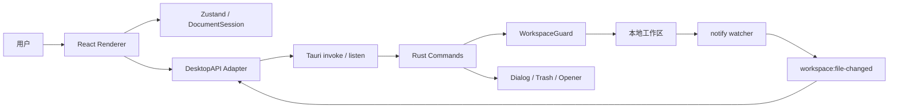
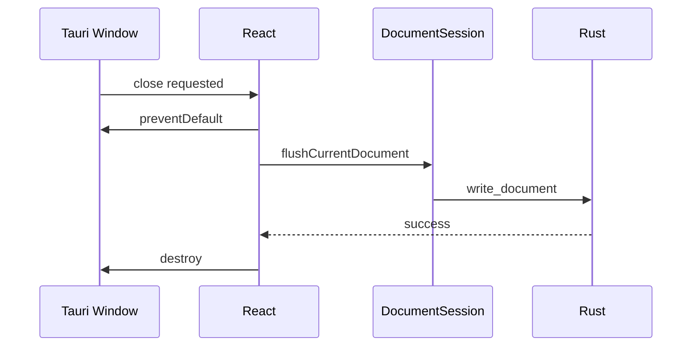

# md-manage 技术架构文档

> 文档状态：当前有效
>
> 运行时：Tauri 2
>
> 适用分支：`feature/tauri-migration`
>
> 最后更新：2026-08-03

## 1. 架构概览

md-manage 是本地优先的 Markdown 桌面应用。React Renderer 负责 UI、编辑和渲染，Rust Core 负责文件、工作区安全、监听和系统集成。两者通过 Tauri command 与 event 通信。

| 层级 | 技术 |
|---|---|
| 桌面容器 | Tauri 2、系统 WebView |
| Core | Rust stable、Tauri commands、notify |
| Renderer | React 18、TypeScript、Vite 5 |
| 状态 | Zustand、Immer、persist |
| 编辑器 | CodeMirror 6 |
| Markdown | unified、remark、rehype、highlight.js |
| 测试 | Cargo test、Vitest |
| 打包 | Tauri bundler |



## 2. 代码职责

### 2.1 Renderer

- `src/main.tsx`：初始化 Tauri DesktopAPI 并挂载 React。
- `src/platform/tauri.ts`：唯一允许直接调用 Tauri JS API 的业务适配层。
- `src/types/ipc.ts`：DesktopAPI 接口契约。
- `src/services/documentSession.ts`：串行保存、切换前 flush。
- `src/App.tsx`：恢复工作区、文件事件、快捷键、关闭握手。
- `src/lib/markdown.ts`：Markdown 渲染与图片 URL 生成。

组件不直接调用 `invoke()`，统一依赖 `window.desktopAPI`。这样 Rust command 名称、插件或错误格式变化不会散落到 UI。

### 2.2 Rust Core

- `src-tauri/src/lib.rs`：Builder、插件、命令注册、自定义图片协议。
- `src-tauri/src/commands.rs`：工作区、文件、图片、导入、导出、配置和 watcher。
- `src-tauri/src/workspace_guard.rs`：词法路径、canonical path 和符号链接边界。
- `src-tauri/src/state.rs`：当前工作区与 watcher 生命周期。
- `src-tauri/src/error.rs`：可序列化稳定错误码。
- `src-tauri/capabilities/default.json`：Renderer 权限。
- `src-tauri/tauri.conf.json`：窗口、CSP、identifier 与打包配置。

## 3. 启动流程

1. Tauri Builder 创建 `AppState`。
2. 注册 dialog、opener、window-state 和日志插件。
3. 注册 `md-manage-resource://` 协议和 Rust commands。
4. 从 Tauri `app_config_dir/config.json` 恢复工作区。
5. 新配置不存在时，尝试只读导入旧 Electron `md-manage/config.json`。
6. 工作区存在则 canonicalize、创建 `.md-manage/images/` 并启动 watcher。
7. Renderer 加载后通过 `get_workspace` 获取路径并读取文件树。

旧 Electron 配置不会删除，确保仍可回滚。

## 4. DesktopAPI 与命令映射

| DesktopAPI | Rust command / Tauri API | 用途 |
|---|---|---|
| `file.read` | `read_document` | 读取 Markdown |
| `file.write` | `write_document` | 保存内容 |
| `file.delete` | `trash_entry` | 移入系统废纸篓 |
| `file.rename` | `rename_entry` | 不覆盖重命名 |
| `file.move` | `move_entry` | 不覆盖移动 |
| `file.list` | `list_entries` | 递归文件树 |
| `file.create` | `create_document` | 独占新建 Markdown |
| `file.createFolder` | `create_folder` | 创建真实目录 |
| `workspace.open` | dialog + `set_workspace` | 选择并注册工作区 |
| `workspace.get` | `get_workspace` | 恢复工作区 |
| `image.save` | `save_image` | 保存粘贴图片 |
| `import.*` | dialog + `import_paths` | 导入文件/目录 |
| `export.html` | save dialog + `write_export` | HTML 导出 |
| `export.pdf` | `window.print()` | 系统打印/另存为 PDF |
| `contextMenu.show` | Tauri Menu API | 原生右键菜单 |
| `window.*` | Tauri Window API | 窗口控制与关闭握手 |
| `shell.openExternal` | opener plugin | 受限外链 |

## 5. 工作区安全

前端传入的任何路径都不构成授权。Rust 从 `AppState` 获取当前工作区并执行：

1. 相对路径拼接到 configured root，绝对路径直接规范化；
2. 使用 `path-clean` 处理 `.` 与 `..`；
3. 目标必须在 configured root 内；
4. 已存在目标直接 canonicalize；
5. 待创建目标向上找到最近存在父级并 canonicalize；
6. canonical path 必须在 canonical workspace root 内；
7. rename 和 move 对源、目标分别检查；
8. 目录扫描跳过所有符号链接。

该逻辑同时被文件命令和图片协议复用。已有测试覆盖正常子路径、父级逃逸和符号链接逃逸。

### 5.1 Capability

Renderer 没有通用 filesystem 权限。默认 capability 只包含：

- Tauri core window/event/menu；
- dialog open/save；
- opener 的受限 URL 和 reveal；
- 应用自定义 commands。

文件系统权限由 Rust WorkspaceGuard 动态控制，不配置 `$HOME/**` 或 `/**`。

### 5.2 CSP

CSP 由 `src-tauri/tauri.conf.json` 的 `app.security.csp` **单点定义**，Tauri 在生产构建时作为响应头注入。生产 WebView 策略：脚本仅允许当前应用；样式允许应用内联样式；连接限制为 Tauri IPC；图片允许受控协议、data/blob 和 HTTP(S)；worker 仅允许同源与 blob。

`index.html` 不得再放 `<meta http-equiv="Content-Security-Policy">`。header 与 meta 同时存在时浏览器执行两者的**交集**，重复定义会静默拦截资源。迁移遗留的一条 meta（`img-src 'self' data: file:`，缺 `md-manage-resource:`）曾导致阅读模式图片在开发和生产环境全部加载失败，已于 2026-08-04 移除。

## 6. 文件行为

- 文件树展示非隐藏目录以及 `.md`、`.markdown` 文件。
- 扫描最大深度 10；Rust 返回确定性基础顺序，Renderer 负责用户可配置的展示顺序。
- Renderer 使用 `Intl.Collator` 递归自然排序，默认文件夹优先、名称升序，并支持名称降序、最近修改和类型排序。
- 文件树没有选中态。`currentFile` 是唯一的文档身份，UI 只用左侧细线标识当前打开的文档。
- 工具栏新建以 `resolveCreateDir` 解析目标：当前打开文档所在目录，未打开文档或路径失效时回退工作区根目录；右键菜单按目标解析目录（右键文件夹 → 内部，右键文件 → 同级，右键空白 → 根目录）。目标目录在创建弹窗中明示。
- 新建和重命名完成后展开祖先目录；打开的文档滚动到可见区域。
- 删除与重命名快捷键作用于当前打开的文档。
- 不提供应用内拖拽移动。移动通过右键「移动到…」触发：弹窗列出工作区根目录与全部子目录，支持关键字筛选和 ↑↓/Enter 选择。
- `validateMoveTarget` 在弹窗内提前拒绝四类非法目标（`same-parent`、`into-self`、`name-conflict` 以及隐含的自身），Rust `move_entry` 仍是最终权威。
- 移动前若当前文档是源或源的后代则先 flush；成功后按新路径重映射 `currentFile`、`recentFiles` 和 `expandedPaths`。
- 命令失败经 `src/lib/errors.ts` 把稳定错误码转成中文文案，UI 不解析平台错误字符串。
- 文件名拒绝空值、路径分隔符、`.`、`..`、尾点/空格与 Windows 保留名。
- 新建文件没有 Markdown 后缀时自动追加 `.md`。
- 新建、rename、move 遇到同名目标时拒绝覆盖。
- 文件夹不能移动到自身或后代目录。
- 删除只调用系统废纸篓，失败不降级永久删除。
- 导入只复制 Markdown；冲突使用 `_1`、`_2` 后缀。

Rust `notify` 递归监听当前工作区，Markdown 或目录事件通过 `workspace:file-changed` 发给 Renderer，Renderer 随后刷新文件树。

## 7. 保存一致性

`documentSession.ts` 保留 Promise 串行队列：

1. 捕获当前文件和内容快照；
2. 将写入追加到 `saveQueue`；
3. 写入完成后重新读取 Store；
4. 只有文件和内容仍匹配快照时才清除 dirty；
5. 单次失败不会永久污染队列。

切换文件、工作区、编辑/阅读模式与关闭窗口前调用 `flushCurrentDocument()`。

关闭流程：



保存失败时窗口保留，并让用户选择重试或放弃退出。

## 8. Markdown 与图片

处理管道：

```text
remark-parse → remark-gfm → remark-rehype
→ 图片路径转换 → rehype-highlight
→ rehype-sanitize → rehype-stringify
```

路径语义：

| Markdown 路径 | 基准 |
|---|---|
| `images/a.png`、`./images/a.png` | 当前 Markdown 目录 |
| `../assets/a.png` | 当前目录，结果必须仍在工作区 |
| `.md-manage/images/a.png` | 工作区根目录 |

合法路径转换为：

```text
md-manage-resource://localhost/<encoded-absolute-path>
```

Rust 协议处理器解码后再次调用 WorkspaceGuard，确认目标是图片文件并设置 MIME。该设计不依赖 `file://`、关闭 WebView 安全策略或开放全盘 asset scope。

## 9. 配置与窗口状态

- 工作区配置：Tauri `app_config_dir/config.json`。
- 编辑器设置：通过 `get_config` / `set_config` 存入类型化配置的 values map。
- UI 主题、侧栏与最近文件：Zustand persist/localStorage。
- 窗口位置、尺寸与状态：Tauri window-state 插件。
- 工作区内容：始终位于用户选择的普通文件夹。

## 10. 构建与测试

```bash
pnpm dev                 # Tauri + Vite
pnpm run build:check     # TypeScript + cargo check
pnpm exec vitest run     # Renderer 单测
pnpm run test:rust       # Rust 单测
pnpm run build:web       # Web 资源
pnpm build               # 当前平台应用与安装包
```

CI 执行 TypeScript、Rust fmt/check/test、Vitest、Web build 和 Tauri no-bundle build。正式发布需要额外配置三平台签名与发布凭据。

## 11. 当前验证结果

- TypeScript：通过。
- Cargo check：通过。
- Clippy `-D warnings`：通过。
- Vitest：6 文件、31 测试通过。
- Rust：3 项路径安全测试通过。
- Web production build：通过。
- macOS ARM64 release：通过。
- macOS `.app` / `.dmg`：通过。
- release 二进制启动冒烟：通过。

## 12. 风险与技术债

| ID | 等级 | 处理状态 |
|---|---|---|
| `RISK-TAURI-PDF` | 高 | 当前使用系统打印；不是 Electron 式直接生成 PDF |
| `RISK-CROSS-PLATFORM` | 高 | Windows/Linux 编译、安装和 WebView 行为尚未实机验证 |
| `RISK-RESOURCE-URL-WIN` | 高 | `src/lib/markdown.ts` 硬编码 `md-manage-resource://localhost/`；Tauri 在 Windows/Android 要求 `http://md-manage-resource.localhost/`，那两个平台图片必然加载失败 |
| `RISK-SAVE-CONFLICT` | 高 | 缺少外部修改版本检测和三平台原子替换 |
| `RISK-E2E` | 中 | 缺少自动化桌面全流程与截图回归 |
| `RISK-CONFIG-MIGRATION` | 中 | 旧配置导入只在代码层实现，尚未三平台验证 |
| `RISK-WATCHER` | 中 | watcher 尚未做批量 debounce，事件后仍全树刷新 |
| `RISK-BUNDLE-SIZE` | 中 | CodeMirror language-data 导致 Renderer 主 chunk 约 1.3 MB |
| `RISK-SIGNING` | 中 | macOS 公证、Windows 签名和自动更新未配置 |

## 13. 扩展规则

- 新文件能力必须实现为业务 command，并首先通过 WorkspaceGuard。
- 禁止给 Renderer 增加通用全盘文件权限。
- 新 Tauri plugin 必须同步更新 capability，并审查最小权限。
- 新 Markdown 标签、属性或协议必须同步更新 sanitize schema。
- CSP 只在 `tauri.conf.json` 维护，禁止在 `index.html` 或组件里重复声明。
- 所有会替换文档上下文的行为必须先 flush 保存队列。
- command 失败使用稳定错误码，不让 UI 解析平台错误字符串。
- 三平台相关能力至少提供 CI 编译验证，并在发布前实机验收。

## 14. 相关文档

- [Tauri 迁移技术方案与实施状态](./Tauri迁移技术方案.md)
- [项目调研报告](./项目调研报告.md)
- [项目优化与重构方案](./项目优化与重构方案.md)
- [文档索引](./README.md)
