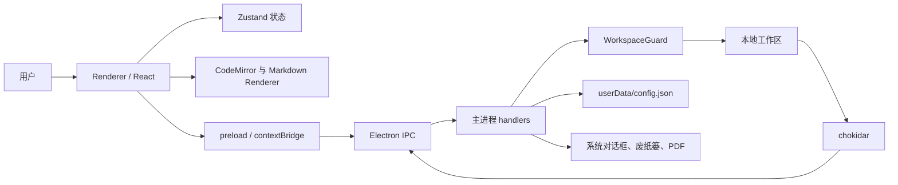
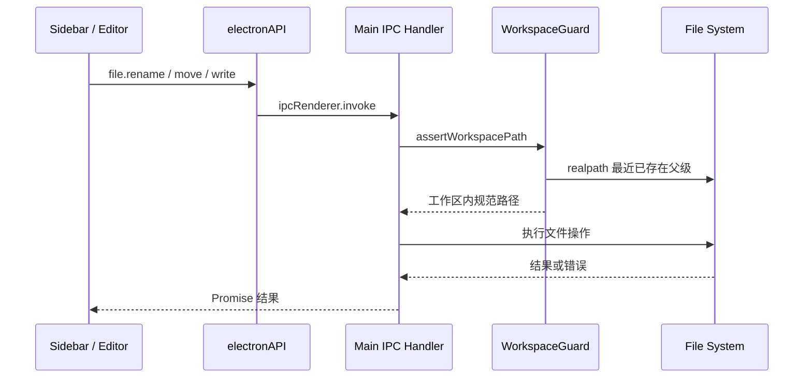
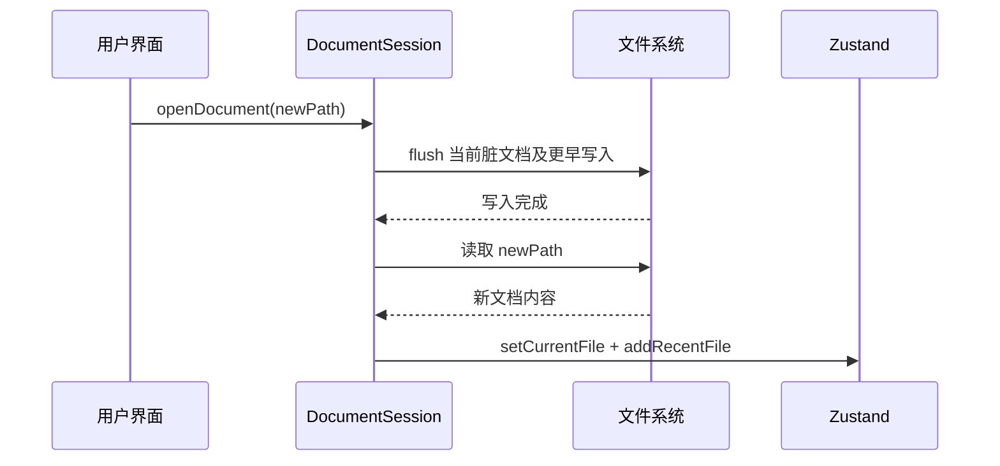

# md-manage 技术架构文档

> 文档状态：当前有效  
> 适用版本：`0.1.0`，分支 `codex/md-manage-optimization`  
> 最后更新：2026-08-03  
> 说明：本文描述当前代码已经实现的行为；尚未落地的内容统一列在“技术债与演进建议”。

## 1. 项目定位

md-manage 是一款本地优先的 Markdown 桌面应用。用户选择一个普通文件夹作为工作区，Markdown 文件、目录和图片都直接保存在文件系统中；应用本身不引入数据库、账号系统或云同步协议。

当前技术栈如下：

| 层级 | 技术 |
|---|---|
| 桌面容器 | Electron 28 |
| 前端 | React 18、TypeScript、Vite 5 |
| 状态管理 | Zustand、Immer、persist middleware |
| 编辑器 | CodeMirror 6 |
| Markdown | unified、remark、rehype、highlight.js |
| 文件监听 | chokidar |
| 测试 | Vitest |
| 打包 | electron-builder |

## 2. 总体架构

应用采用 Electron 的主进程、preload 桥接层和 Renderer 三层结构。Renderer 不直接访问 Node.js；需要操作文件、窗口或系统对话框时，通过 `window.electronAPI` 调用白名单 IPC。



### 2.1 进程职责

| 模块 | 主要职责 | 不应承担的职责 |
|---|---|---|
| Electron 主进程 | 窗口生命周期、文件系统、导入导出、配置、监听器、安全校验 | UI 状态和编辑器交互 |
| preload | 将明确的 IPC 方法暴露为类型化 API，转发主进程事件 | 任意 Node.js 能力或通用 IPC 通道 |
| Renderer | 页面渲染、编辑、阅读、状态管理、用户交互、保存调度 | 绕过 IPC 直接读写磁盘 |

关键入口：

- `electron/main.ts`：创建窗口、注册 IPC、恢复监听、处理关闭握手。
- `electron/preload.ts`：暴露 `window.electronAPI`。
- `src/App.tsx`：根布局、工作区恢复、全局事件和主题。
- `src/stores/appStore.ts`：Renderer 的全局状态。

## 3. 启动与工作区生命周期

### 3.1 启动流程

1. Electron `app.whenReady()` 后注册配置、文件、右键菜单、窗口和导入相关 IPC。
2. 主进程创建 `BrowserWindow`，从窗口状态文件恢复尺寸、位置、最大化和全屏状态。
3. 开发环境加载 Vite dev server；生产环境加载打包后的 `renderer/index.html`。
4. 主进程从 `userData/config.json` 读取上次工作区并启动 chokidar 监听。
5. Renderer 启动后通过 `workspace:get` 恢复工作区，再加载文件树。

### 3.2 选择工作区

`workspace:open` 打开系统目录选择器。选中后主进程会：

1. 创建 `<workspace>/.md-manage/images/`；
2. 将路径写入配置；
3. 停止旧监听器并监听新工作区；
4. 将工作区路径返回 Renderer。

切换工作区前，Renderer 应先调用 `flushCurrentDocument()`，保证当前编辑内容已经写入磁盘。

### 3.3 文件树

`file:list` 递归读取目录，只展示：

- 非隐藏目录；
- `.md` 与 `.markdown` 文件，不区分扩展名大小写。

节点包含名称、绝对路径、父目录、类型、修改时间和可选文件大小。当前实现一次递归读取整棵树，按修改时间降序排列。chokidar 监听深度上限为 10；收到 Markdown 文件或目录变化后，通过 `file:changed` 通知 Renderer 刷新。

## 4. 文件操作与数据流

文件管理支持读取、写入、新建、创建文件夹、重命名、移动、导入和移到系统废纸篓。



### 4.1 行为约束

- 新建文档未提供扩展名时自动追加 `.md`。
- 新建使用独占写入，已有同名文件时不会覆盖。
- 重命名和移动在目标存在时返回错误，不做静默覆盖。
- 文件夹不能移动到自身或自身子目录。
- 删除使用 Electron `shell.trashItem`，失败时把错误交给 UI，不回退为永久删除。
- 导入发生同名冲突时使用 `_1`、`_2` 等后缀生成新名称。
- 文件名拒绝路径分隔符、空名称、`.`、`..`、尾随点/空格和 Windows 保留名。

## 5. 文档会话与保存一致性

`src/services/documentSession.ts` 是文档切换和保存的协调层。它维护一个进程内 Promise 队列，所有写入串行执行。

### 5.1 自动保存

编辑器内容变更后将 Zustand 中的 `currentContent` 更新并标记 `isDirty`。编辑器以 2 秒 debounce 调用 `saveCurrentDocument()`：

1. 捕获当前文件路径和内容快照；
2. 将写入任务追加到 `saveQueue`；
3. 写入成功后再次读取当前状态；
4. 只有“当前文件和内容仍与该快照一致”时才标记为已保存。

该条件可防止较早写入完成后把较新的、尚未落盘的编辑错误标记为已保存。单次写入失败不会污染后续队列。

### 5.2 切换文档

`openDocument(filePath)` 的顺序固定为：



因此快速点击多个文件时，不会在旧文档尚未保存的情况下直接替换编辑状态。

### 5.3 窗口关闭握手

主进程首次收到 `close` 事件时阻止关闭并发送 `app:before-close`。Renderer 收到事件后刷新当前文档，再调用 `window:confirmClose`；主进程设置 `closeApproved` 后重新关闭窗口。这样可以覆盖点击系统关闭按钮和应用内关闭按钮。

当前机制保证应用内写入队列完成，但尚未实现“磁盘文件被其他程序修改”时的版本冲突检测。

## 6. Markdown 编辑与渲染

### 6.1 编辑链路

CodeMirror 6 提供 Markdown 高亮、行号、自动换行、查找替换和常用格式快捷键。编辑内容以字符串保存在 Zustand，编辑器组件负责将 CodeMirror 变更同步到 Store。

图片粘贴或拖入时，Renderer 将字节数组和扩展名交给 `image:save`。主进程校验扩展名，并使用时间戳加 UUID 写入：

```text
<workspace>/.md-manage/images/<timestamp>-<uuid>.<ext>
```

IPC 返回 `.md-manage/images/...` 形式的 Markdown 路径，由编辑器插入当前光标位置。

### 6.2 渲染管道

`src/lib/markdown.ts` 中的处理顺序为：

```text
Markdown
  → remark-parse
  → remark-gfm
  → remark-rehype
  → 本地图片路径转换
  → rehype-highlight
  → rehype-sanitize
  → rehype-stringify
  → HTML
```

GFM 支持表格、任务列表、删除线等语法；代码块由 highlight.js 自动识别并高亮；最终 HTML 经 sanitize 白名单清洗。

### 6.3 本地图片路径规则

图片路径解析必须同时获得工作区路径和当前 Markdown 文件路径：

| Markdown 中的路径 | 解析基准 | 示例 |
|---|---|---|
| `./images/a.png`、`images/a.png` | 当前 Markdown 文件所在目录 | `docs/a.md` → `docs/images/a.png` |
| `../assets/a.png` | 当前 Markdown 文件所在目录，规范化后仍须在工作区内 | `docs/a.md` → `assets/a.png` |
| `.md-manage/images/a.png` | 工作区根目录 | `<workspace>/.md-manage/images/a.png` |
| `http(s)://...`、`data:...`、已有 `file://...` | 保持原值 | 不参与本地路径拼接 |

合法本地路径会转换为编码后的 `file://` URL，空格、中文和特殊字符按路径段编码。规范化后落在工作区外的路径不会转换，从而阻止 Markdown 通过 `../` 读取工作区外文件。

当前 `rehype-sanitize` 配置显式允许图片 `src` 的 `file` 协议，以及代码高亮所需的 class 属性。

### 6.4 阅读与导出

阅读模式展示渲染后的 HTML，并提供文内搜索和图片 Lightbox。HTML 导出将渲染内容包装为完整文档；PDF 导出由主进程创建隐藏窗口载入 HTML，再调用 Chromium `printToPDF`。

## 7. 状态与持久化

| 数据 | 位置 | 生命周期 |
|---|---|---|
| Markdown、目录、图片 | 用户工作区 | 用户直接管理，应用退出后保留 |
| 工作区路径及主进程配置 | Electron `userData/config.json` | 跨启动保留 |
| 窗口位置、尺寸、最大化、全屏 | Electron userData 下的窗口状态文件 | 跨启动保留 |
| 主题、侧栏显示、工作区副本、最近文件 | localStorage：`md-manage-ui-state` | 跨启动保留 |
| 当前文件内容、脏状态、文件树、弹窗状态 | Zustand 内存状态 | 当前 Renderer 会话 |

工作区以主进程配置为最终恢复来源；Zustand 中保存的工作区用于 UI 持久化，不应被当作文件权限边界。

## 8. IPC API

类型契约位于 `src/types/ipc.ts`，实现位于 `electron/preload.ts` 和 `electron/ipc/`。

| 命名空间 | 方法 / 事件 | 用途 |
|---|---|---|
| `file` | `read`、`write`、`delete`、`rename`、`move`、`list`、`create`、`createFolder` | 工作区文件 CRUD |
| `workspace` | `open`、`get`、`init` | 选择、恢复、初始化工作区 |
| `config` | `get`、`set` | 读写应用配置 |
| `image` | `save`、`getAbsPath` | 保存粘贴图片、解析受控路径 |
| `export` | `pdf`、`html` | 导出阅读内容 |
| `import` | `files`、`folder`、`drop` | 导入 Markdown 文件或目录 |
| `contextMenu` | `show` | 打开文件或编辑器原生菜单 |
| `window` | `minimize`、`maximize`、`close`、全屏查询/设置、`confirmClose` | 窗口控制与关闭确认 |
| 主进程事件 | `onFileChanged` | 文件或目录变化通知 |
| 主进程事件 | `onMenuAction` | 原生菜单动作通知 |
| 主进程事件 | `onBeforeClose` | 保存后关闭握手 |

新增 IPC 时需要同时更新主进程 handler、preload 白名单和 `src/types/ipc.ts`，避免运行时接口与 TypeScript 契约漂移。

## 9. 安全模型

### 9.1 已实施措施

- `nodeIntegration: false`，Renderer 无法直接使用 Node.js。
- `contextIsolation: true`，页面与 preload 运行在不同上下文。
- preload 只提供业务所需方法，不暴露原始 `ipcRenderer`。
- `WorkspaceGuard` 对 Renderer 传入的文件路径执行词法边界检查。
- 对路径中最近存在的父级执行 `realpath`，拒绝通过符号链接逃逸工作区。
- 新建、重命名、移动和图片扩展名均有输入约束。
- Markdown HTML 使用 `rehype-sanitize` 清洗。
- 本地图片解析只接受规范化后仍位于工作区内的路径。
- 外部链接通过系统浏览器打开，并禁止在应用内新建窗口。

### 9.2 当前风险

BrowserWindow 当前仍使用 `sandbox: false` 和 `webSecurity: false`。这是当前本地 `file://` 图片加载方案留下的宽松配置，不应视为最终安全状态。生产化前应注册受控自定义协议，例如 `md-manage-resource://`，由主进程完成路径校验和文件响应；迁移后恢复 `webSecurity: true` 并评估启用 sandbox。

此外，配置 IPC 的 key/value 仍较通用；若未来 Renderer 可加载非可信页面，应按配置项建立严格白名单和数据校验。

## 10. 构建、测试与发布

### 10.1 常用命令

```bash
pnpm install
pnpm run dev
pnpm run build:check
pnpm exec vitest run
pnpm run build
pnpm run package
```

- `build:check` 分别检查 Renderer 与 Electron TypeScript 配置。
- `vitest run` 执行一次性单元测试，适用于 CI。
- `build` 生成 Renderer、main 和 preload 生产产物。
- `package` 先构建，再由 electron-builder 生成安装包。

### 10.2 测试重点

当前单元测试覆盖文档保存队列、切换前刷新、Markdown 图片路径和基础工具函数。涉及真实窗口、系统对话框、废纸篓、PDF 与安装包的功能仍需 Electron 集成或人工验收。

建议每次涉及文件操作、保存或渲染的改动至少执行：

```bash
pnpm run build:check
pnpm exec vitest run
pnpm run build
```

并人工验证以下主流程：选择/恢复工作区、打开与快速切换文件、编辑自动保存、关闭前保存、CRUD、导入、相对图片、阅读搜索和导出。

## 11. 开发扩展指南

### 11.1 增加文件操作

1. 在主进程 handler 中实现，并首先调用 `assertWorkspacePath`。
2. 明确冲突策略、失败语义和是否可恢复，禁止默认覆盖。
3. 在 preload 中仅暴露所需参数，不暴露通用文件系统能力。
4. 同步更新 IPC 类型与单元测试。
5. 验证普通路径、中文路径、同名目标、符号链接和越界路径。

### 11.2 增加 Markdown 能力

1. 在 unified 管道中选择 remark 或 rehype 插件，并确认执行顺序。
2. 插件若生成新标签、属性或协议，同步收紧地扩展 sanitize schema。
3. 同时验证阅读模式、HTML/PDF 导出和特殊字符路径。
4. 不要直接信任 Markdown 中的 HTML、URL 或本地路径。

### 11.3 修改保存逻辑

所有保存入口应复用 `documentSession`，避免组件各自直接并发写入。任何会替换当前文档上下文的操作——切换文件、工作区、模式或关闭窗口——都应先等待 `flushCurrentDocument()`。

## 12. 技术债与演进建议

按优先级建议继续处理：

1. **P0：收紧 Electron 安全配置。** 用受控协议替代直接 `file://`，恢复 `webSecurity` 并评估 sandbox。
2. **P0：外部修改冲突处理。** 文件内容应携带 mtime 或内容版本；保存前检测磁盘变化，并提供覆盖、重新加载或另存为选择。
3. **P1：文件树增量化。** 大型工作区改为懒加载、按目录刷新或增量合并，避免每次变化重扫整棵树。
4. **P1：设置真正接入编辑器。** 将字体大小、Tab 宽度、自动保存开关和间隔变为单一类型化配置源。
5. **P1：原子写入与恢复。** 采用同目录临时文件加 rename，并保留异常退出恢复信息。
6. **P2：拆分 Renderer bundle。** 对 CodeMirror language-data、阅读器和设置面板按需加载。
7. **P2：完善自动化。** 增加 Playwright/Electron 端到端测试和 macOS、Windows、Linux 安装包验收矩阵。
8. **P2：评估 Tauri。** 若安装包体积和内存成为核心指标，可进行 Rust 文件层与资源协议 PoC；迁移会重写主进程、preload/IPC、窗口和导出能力，不属于低成本替换。

## 13. 关键源码索引

| 领域 | 文件 |
|---|---|
| 应用与窗口生命周期 | `electron/main.ts`、`electron/windowState.ts` |
| 文件、工作区、图片、导出 | `electron/ipc/fileSystem.ts` |
| 导入 | `electron/ipc/import.ts` |
| 配置与窗口 IPC | `electron/ipc/config.ts`、`electron/ipc/window.ts` |
| 路径安全 | `electron/services/workspaceGuard.ts` |
| preload 白名单 | `electron/preload.ts` |
| 根 UI 与全局事件 | `src/App.tsx` |
| 全局状态 | `src/stores/appStore.ts` |
| 保存与切换协调 | `src/services/documentSession.ts` |
| Markdown 渲染 | `src/lib/markdown.ts` |
| IPC 类型契约 | `src/types/ipc.ts` |
| 单元测试 | `tests/unit/` |

## 14. 相关文档

- [项目调研报告](./项目调研报告.md)
- [项目优化与重构方案](./项目优化与重构方案.md)
- [文档索引](./README.md)
