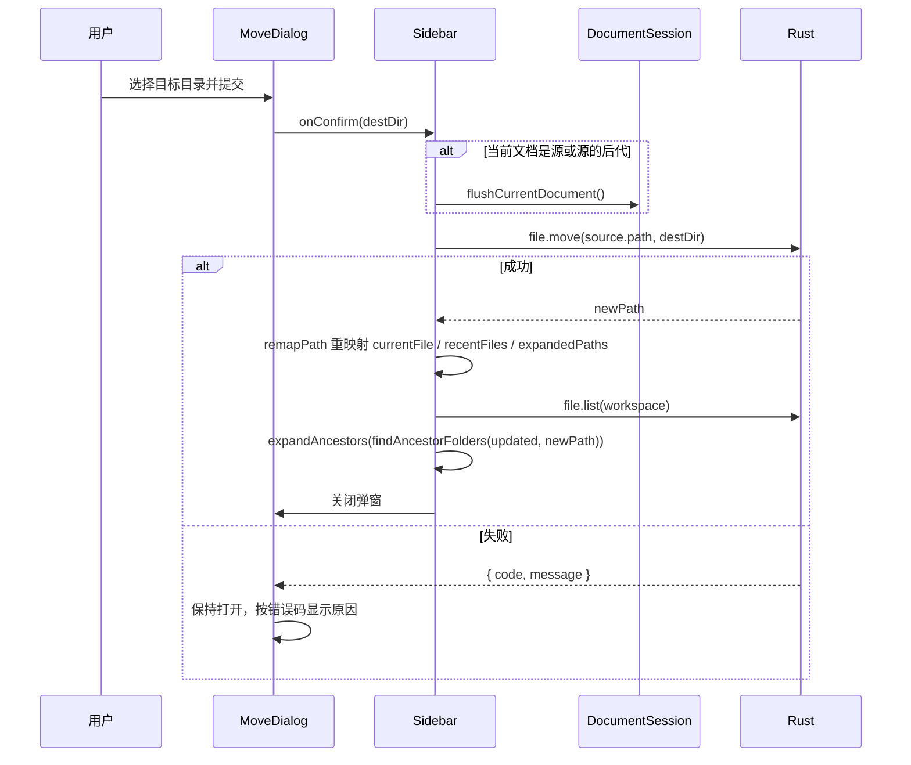

# md-manage 「移动到…」功能技术方案

> 文档状态：当前有效
>
> 实施日期：2026-08-04
>
> 适用分支：`feature/tauri-migration`
>
> 背景：拖拽移动已移除，见 [左侧文件管理系统优化技术方案](./左侧文件管理系统优化技术方案.md)

## 1. 背景与目标

拖拽移动于 2026-08-04 移除后，应用内失去了调整文件位置的能力。本方案用显式的右键「移动到…」补回该能力。

不沿用拖拽的原因不只是 `dragDropEnabled` 默认接管 webview 拖放，还有语义问题：拖拽的落点靠鼠标位置推断，失败反馈弱，因此当初必须叠加二次确认弹窗和一次性撤销来兜底。菜单式移动是显式的——源明确、目标明确、执行前可校验——所以**不需要二次确认，也不为它单独实现撤销**。

## 2. Rust 侧：零改动

`move_entry` 已具备全部所需校验，无需修改：

| 校验 | 实现 |
|---|---|
| 源路径在工作区内 | `resolve_workspace_path(&state, path)` |
| 目标目录在工作区内 | `resolve_workspace_path(&state, destination)` |
| 不能移入自身或后代 | `destination.starts_with(&source)` → `InvalidMove` |
| 目标最终路径仍在工作区内 | 对 `destination.join(file_name)` 再次 resolve |
| 同名不覆盖 | `assert_available(&target)` → `AlreadyExists` |
| 返回新路径 | `Ok(target)` |

## 3. 入口

`platform/tauri.ts` 的 `showFileMenu` 在「重命名」之后插入「移动到…」：

```text
新建文件
新建子文件夹
──────────
重命名          ⌘⏎
移动到…                ← 新增
在文件夹中打开   ⌘⇧O
──────────
删除
```

- 右键侧栏空白（`isRoot === 'true'`）不显示该项，工作区根目录本身不可移动
- `MenuAction['type']` 增加 `'move'`，payload 沿用现有的 `path` / `parentPath` / `isFolder`
- 不设快捷键：选中态已移除，全局快捷键只能作用于 `currentFile`，语义窄且易误触

## 4. 目标选择弹窗

`src/components/dialogs/MoveDialog.tsx`，沿用 `CreateDialog` 的 backdrop + form 结构。

```text
┌────────────────────────────────────┐
│ 移动文件「功能2-Markdown编辑器.md」  │
│ 当前位置：design                    │
├────────────────────────────────────┤
│ 🔎 筛选目录…                        │
├────────────────────────────────────┤
│   工作区根目录                       │
│   document                          │
│     archive                         │
│     design            已在此处      │
│     product                         │
│   src                               │
├────────────────────────────────────┤
│              [取消]  [移动]         │
└────────────────────────────────────┘
```

交互：

- 打开时焦点在筛选框，输入即过滤（匹配目录名或工作区相对路径，大小写不敏感）
- ↑/↓ 在**可选项之间**循环移动高亮，跳过置灰项；Enter 提交；Escape 取消；点击 backdrop 取消
- 单击选中，双击直接提交
- 高亮项用黑底白字；置灰项右侧显示不可用原因
- 候选集变化后高亮自动落到第一个可选项
- 提交中禁用全部控件，失败时保持弹窗打开并在底部显示原因

## 5. 纯函数

`src/lib/explorer/moveTargets.ts`：

```ts
export function collectFolderOptions(
  workspace: string,
  nodes: FileNode[]
): FolderOption[];   // 工作区根 + 递归全部 folder，按文件树顺序，带 depth 缩进

export type MoveTargetStatus = 'ok' | 'same-parent' | 'into-self' | 'name-conflict';

export function validateMoveTarget(
  source: FileNode,
  destDir: string,
  nodes: FileNode[]
): MoveTargetStatus;
```

`validateMoveTarget` 的判定顺序与文案：

| 返回值 | 条件 | 弹窗文案 |
|---|---|---|
| `same-parent` | `destDir === source.parentPath` | 已在此处 |
| `into-self` | `destDir` 等于源或位于源之下 | 不能移入自身 |
| `name-conflict` | 目标目录已有同名项（大小写不敏感） | 已存在同名项 |
| `ok` | 以上都不成立 | — |

同名比较使用 `toLocaleLowerCase()`，与 macOS APFS、Windows NTFS 的默认大小写不敏感行为一致；Rust 的 `path.exists()` 在这些文件系统上同样是大小写不敏感的，两侧判定因此不会打架。

前端校验只用于提前反馈和禁用选项，**Rust 仍是最终权威**——文件树可能已被外部改动。

同时从 `Sidebar.tsx` 提取到 `lib/explorer/tree.ts` 的公共纯函数：

- `childrenOf(nodes, dir)`：目标目录的直接子项，`dir` 为工作区根时按 `parentPath` 匹配顶层节点；`suggestAvailableName` 一并改用它
- `isSameOrDescendant(candidate, parent)`：兼容 `/` 与 `\` 分隔符
- `remapPath(candidate, oldPath, newPath)`：路径前缀重映射

## 6. 执行流程



`handleMoveConfirm` 不捕获异常，交给 `MoveDialog` 处理——这样失败时弹窗不关闭，用户可以直接换一个目标重试。

## 7. 错误码文案

新增 `src/lib/errors.ts`，把 `src-tauri/src/error.rs` 的稳定错误码映射为中文：

| code | 文案 |
|---|---|
| `NO_WORKSPACE` | 尚未选择工作区。 |
| `OUTSIDE_WORKSPACE` | 目标不在当前工作区内，操作已取消。 |
| `INVALID_NAME` | 名称不可用：不能为空，不能包含路径分隔符，也不能以点或空格结尾。 |
| `ALREADY_EXISTS` | 目标位置已存在同名项目，没有做任何修改。 |
| `INVALID_MOVE` | 不能把文件夹移动到它自己或它的子目录里。 |
| `INVALID_IMAGE_EXTENSION` | 不支持这种图片格式。 |
| `INVALID_EXPORT_PATH` | 导出路径不可用。 |
| `IO_ERROR` | 文件系统操作失败，请检查文件是否被其他程序占用。 |

`describeDesktopError(error, fallback)` 在无法识别 code 时回退到调用方文案。已接入：移动、重命名、删除（Sidebar 与 App 两处）、新建。这落实了 [项目优化与重构方案](./项目优化与重构方案.md) §2.4 和 §4.2 的「结构化结果替代控制台日志」。

## 8. 文件清单

| 文件 | 改动 |
|---|---|
| `src-tauri/**` | 无 |
| `src/types/ipc.ts` | `MenuAction['type']` 增加 `'move'` |
| `src/platform/tauri.ts` | `showFileMenu` 增加「移动到…」 |
| `src/lib/errors.ts` | 新增 |
| `src/lib/explorer/moveTargets.ts` | 新增 |
| `src/lib/explorer/tree.ts` | 新增 `childrenOf` / `isSameOrDescendant` / `remapPath`，`suggestAvailableName` 改用 `childrenOf` |
| `src/components/dialogs/MoveDialog.tsx` + `.module.css` | 新增 |
| `src/components/sidebar/Sidebar.tsx` | `moving` 状态、`'move'` 菜单分支、`handleMoveConfirm`；删除本地重复的 `isSameOrDescendant` / `remapPath` |
| `src/components/dialogs/CreateDialog.tsx`、`src/App.tsx` | 错误文案改用 `describeDesktopError` |
| `tests/unit/moveTargets.test.ts` | 新增 8 项 |
| `tests/unit/explorerTree.test.ts` | 新增 2 项（分隔符兼容、前缀重映射） |

## 9. 测试

`pnpm exec vitest run`：7 文件、41 项通过。

`moveTargets.test.ts` 覆盖：

- 工作区根排在最前，其余目录按文件树顺序；
- 排除文件，`depth` 缩进正确，相对路径标签正确；
- 无关目录 → `ok`；
- 文件的当前父目录 → `same-parent`；文件夹选到工作区根（其父目录）→ `same-parent`；
- 文件夹选到自身 → `into-self`；选到自身子目录 → `into-self`；
- 目标已有同名项 → `name-conflict`；大小写不同的同名 → 同样 `name-conflict`；
- 子目录内的文件移到工作区根 → `ok`。

`MoveDialog` 的键盘导航和提交流程没有自动化测试——仓库当前没有组件测试设施（devDependencies 里没有 jsdom 和 @testing-library/react）。这条记为待补。

## 10. 明确不做

| 项 | 原因 |
|---|---|
| 多选批量移动 | 选中态已移除，要做得先把选择模型加回来 |
| 移动到工作区外 | 违反 WorkspaceGuard 边界 |
| 移动撤销 | `RISK-UNDO-SCOPE` 不变；显式移动的误操作概率远低于拖拽 |
| 文件夹同名时合并 | 保持 Rust 的「拒绝」行为，避免隐式覆盖 |
| 系统外部文件拖入导入 | 属 import 链路，与本方案无关 |

## 11. 遗留风险

| ID | 等级 | 说明 |
|---|---|---|
| `RISK-MOVE-DIALOG-TEST` | 中 | 弹窗交互（筛选、键盘导航、提交、失败保持打开）缺自动化测试 |
| `RISK-MOVE-STALE-TREE` | 低 | 弹窗打开期间工作区被外部改动，前端校验可能过期；Rust 会拒绝，弹窗显示错误码文案，不会误写 |
| `RISK-UNDO-SCOPE` | 中 | 移动没有撤销入口，与删除一致 |

## 12. 相关文档

- [技术架构文档](./技术架构文档.md)
- [左侧文件管理系统优化技术方案](./左侧文件管理系统优化技术方案.md)
- [项目优化与重构方案](./项目优化与重构方案.md)
- [文档索引](./README.md)
