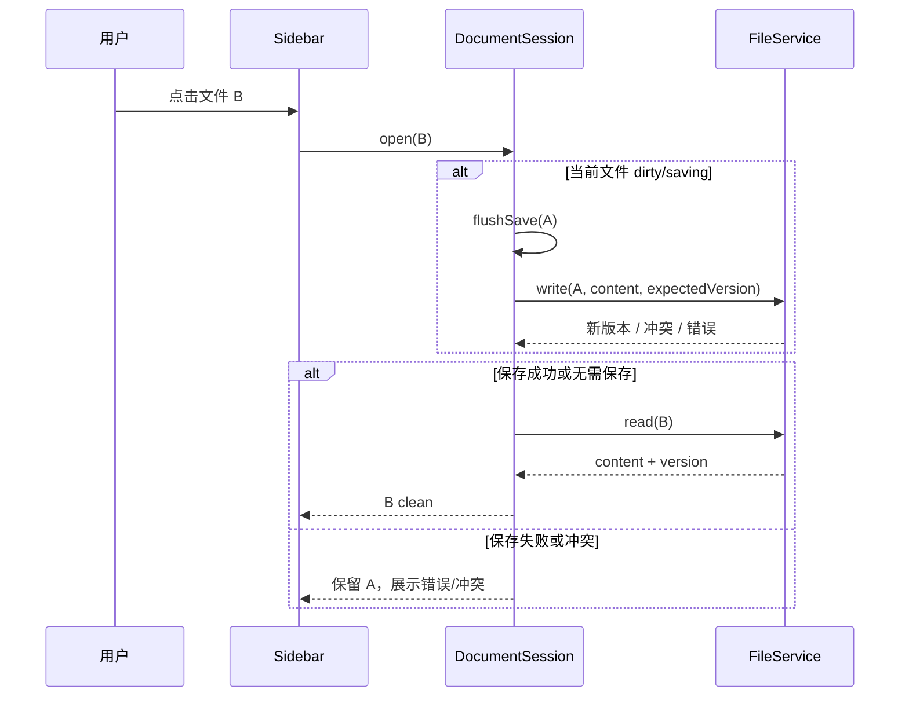

# md-manage 项目优化与重构方案

> 制定日期：2026-08-03  
> 适用基线：`main@9295ac1`  
> 输入依据：[`项目调研报告.md`](./项目调研报告.md)  
> 方案目标：先消除数据风险，再收紧安全边界，随后补齐功能闭环并优化性能与发布工程

---

## 1. 方案结论

当前项目不需要推倒重写。Electron、React、CodeMirror、unified 和 Zustand 的选型都可以保留，已有编辑器与阅读器也具备继续演进的价值。真正需要重构的是三条基础链路：

1. **文档会话链路**：从“组件各自保存 + `isDirty` 布尔值”重构为统一的文档会话状态机和串行保存队列。
2. **文件系统链路**：从“渲染进程传绝对路径”重构为“渲染进程只传工作区相对 ID，主进程统一解析、校验和执行”。
3. **事件同步链路**：从“任意变化全量刷新文件树”重构为“结构化文件事件 + 当前文档版本冲突处理”。

建议暂停 KaTeX、Mermaid、版本历史等增量功能，按照以下顺序实施：


目标状态不是“功能更多”，而是：

- 用户编辑的内容不会因切换、移动、关闭或竞态而静默丢失。
- 文件操作不会静默覆盖已有数据。
- 渲染进程无法访问工作区外的文件。
- macOS、Windows 和 Linux 使用同一套路径语义。
- 设置页展示的每个选项都真实生效。
- 外部修改不会被应用静默覆盖。
- CI 能阻止类型、测试、构建和依赖安全回归。

---

## 2. 优化原则

### 2.1 数据安全高于交互速度

文件切换可以多等待几十毫秒，但不能丢内容；重命名可以多一个冲突提示，但不能覆盖文件。任何影响当前文档身份或生命周期的操作，都必须经过统一会话服务。

### 2.2 主进程拥有文件系统真相

路径拼接、权限验证、冲突检测、原子写入、版本读取都应在 Electron 主进程完成。React 只表达“打开文档”“把文档移动到目录”“保存此版本”等意图。

### 2.3 不保留半成品功能

对已经展示给用户但不生效的功能，只有两种处理：立即接通，或先移除 UI。死代码、未使用 IPC 和与产品无关的旧文档不应长期留在主分支。

### 2.4 用结构化结果替代控制台日志

主进程返回稳定的错误码，渲染进程统一展示 toast/dialog。不能让用户通过开发者工具判断保存是否成功。

### 2.5 适度重构，避免过度分层

项目体量约 7 千行，不适合引入复杂的领域框架。建议只新增少量明确边界：`DocumentSession`、`FileService`、`WorkspaceGuard`、`SettingsService` 和结构化 IPC contract。

---

## 3. 功能取舍建议

### 3.1 建议保留并重点完善

| 功能 | 决策 | 原因 |
|---|---|---|
| 本地工作区 | 保留 | 产品核心定位 |
| 文件树 CRUD | 保留并重构 | 核心能力，但当前路径和冲突处理不可靠 |
| CodeMirror 编辑 | 保留 | 实现成熟，替换收益低 |
| 自动保存 | 保留并强制开启 | 最符合本地写作工具预期，但必须可靠 |
| 阅读模式 | 保留 | 已形成差异化价值 |
| GFM、代码高亮 | 保留 | 使用价值高 |
| 图片粘贴/拖入 | 保留并修复路径 | 高频写作需求 |
| PDF/HTML 导出 | 保留并加固 | 已可用，修复成本低 |
| 明暗主题 | 保留 | 已基本完成 |
| 编辑/阅读查找 | 保留 | 功能完成度较高 |

### 3.2 建议调整产品定义

#### 自动保存：不要提供关闭开关

建议删除“自动保存开关”和“自动保存延迟”设置，自动保存固定开启。原因：

- 用户关闭后必须新增关闭、切换和退出时的未保存确认，复杂度显著上升。
- 本地 Markdown 工具的合理默认是持续保存。
- 延迟属于内部性能参数，不是多数用户需要理解的产品选项。

建议固定 800～1500ms debounce，同时保留 `Cmd/Ctrl+S` 立即保存。状态栏显示“正在保存 / 已保存 / 保存失败 / 外部冲突”。

#### 拖拽排序：改名为“拖拽移动”

当前文件列表按 mtime 排序，拖拽只改变目录。建议明确把功能定义为“移动文件/文件夹”，不要实现自定义同级排序。自定义顺序需要额外元数据，会破坏“普通文件夹即工作区”的透明性。

若未来确有排序需求，优先提供“名称 / 修改时间 / 创建时间”的排序方式，不维护私有手工顺序。

#### Front Matter：保持源码编辑，不新增独立标题/标签编辑器

当前产品定位是轻量 Markdown 编辑器。独立 `TitleInput` 和 `TagEditor` 会增加双向同步、格式保真和未知字段处理成本。建议：

- 编辑器继续展示完整 Markdown 源文，包括 Front Matter。
- 阅读模式可读取 `title` 作为展示标题。
- 提供 Front Matter 代码片段或新建模板即可。
- 删除旧文档中不存在的 TitleInput/TagEditor 描述。

只有明确要发展知识库、标签检索时，再设计结构化元数据编辑。

#### 新建文件夹：改为真实 `createFolder`

不要再通过写入 `.gitkeep` 间接创建目录。新增主进程 `folder.create`，直接调用 `mkdir`；空目录应正常显示。`.gitkeep` 是 Git 约定，不应成为运行时数据。

#### 删除：默认只进废纸篓

不建议 `trashItem` 失败后自动永久删除。合理流程是：

1. 默认移动到废纸篓。
2. 失败时明确提示原因。
3. 如需永久删除，必须由用户二次确认并单独触发。

#### `.md` 与 `.markdown`：统一支持

既然导入对话框已经允许 `.markdown`，文件树、监听器、目录导入和拖放也应大小写不敏感地支持 `.md`、`.markdown`。若只想支持 `.md`，则应从导入入口彻底移除 `.markdown`。建议选择前者。

### 3.3 建议补齐

| 功能 | 建议 |
|---|---|
| 导入文件/文件夹 | 接入侧边栏“导入”菜单，复用已有 IPC 并补安全校验 |
| 外部变更冲突 | clean 自动重载，dirty 显示冲突条并允许选择 |
| 用户提示 | 新增统一 toast、确认框和错误详情 |
| 排序方式 | 支持名称/修改时间切换，默认名称或保留当前 mtime |
| 最近文件 | 若短期不做快速打开，则删除未使用状态；否则实现 `Cmd/Ctrl+P` 后再保留 |
| 设置加载 | 主题、字体大小、Tab 宽度真实读取、应用、持久化 |

### 3.4 建议暂缓或删除

| 功能/代码 | 决策 | 原因 |
|---|---|---|
| Markdown Worker | 暂时删除 | 未接入；没有基准证明当前需要 |
| 未使用 window IPC | 删除或等 UI 需要时再加 | 缩小攻击面和维护面 |
| `image.getAbsPath` | 删除 | 当前未使用且存在路径穿越风险 |
| `workspace.init` | 合并到 open/restore | 避免多个初始化入口 |
| 版本历史 | 继续暂缓 | 自动保存和冲突机制稳定前不应增加复杂度 |
| KaTeX / Mermaid | 暂缓 | 不应抢占可靠性迭代 |
| 自定义文件排序 | 不做 | 与透明文件系统定位冲突 |
| 云同步/账户 | 不做 | 超出当前产品边界 |

### 3.5 左侧文件管理专项改造

#### 是否需要修改

**需要，而且属于核心重构，不只是视觉优化。**

当前侧边栏在小型工作区中基本可用，但它同时承担文件系统操作、路径计算、当前文档切换、菜单事件、拖拽和主题/设置入口，已经出现职责过重。更关键的是，文件树的操作结果会直接影响编辑器会话，现有实现没有可靠处理未保存内容、父目录移动、同名冲突和外部变化。

建议保留现有“左侧树 + 右侧编辑器”的整体形态，重构数据模型和交互流程，不必推翻重做视觉风格。

#### 当前问题

| 问题 | 影响 | 优先级 |
|---|---|---|
| 使用绝对路径并在 React 中用 `/` 拆分 | Windows 路径、移动和重命名不可靠 | P1 |
| 文件切换绕过统一保存流程 | 2 秒自动保存窗口内可能丢内容 | P0 |
| 移动当前文件或其父目录后不更新 currentFile | 后续保存可能在旧路径重新创建文件 | P1 |
| rename/move 没有同名冲突流程 | 可能覆盖已有文件 | P0 |
| 新建文件先写时间戳文件再改名 | 取消重命名会留下无意义文件 | P2 |
| 新建文件夹依靠 `.gitkeep` | 产生与产品无关的隐藏文件 | P2 |
| 文件夹默认全部展开且不记忆状态 | 大工作区信息噪声高 | P2 |
| 每次变化递归重扫整棵树 | 大工作区性能和闪动问题 | P2 |
| 监听器只刷新树，不处理当前文档内容 | 外部修改可能被应用覆盖 | P1 |
| `.markdown` 可导入但树中不可见 | 用户误以为导入失败 | P2 |
| 拖拽被文档称为“排序”，实际是移动 | 用户预期错误 | P2 |
| 内部移动和外部导入没有统一交互 | 已有 import IPC 无可见入口 | P2 |
| 操作错误只写 console | 用户不知道失败或如何恢复 | P1 |
| 文件工具栏混入主题和设置 | 文件操作层级不聚焦 | P3 |
| 仅有“打开文件”状态，没有独立的树选择/焦点 | 新建目标目录、键盘操作语义模糊 | P2 |
| 缺少键盘树导航和 ARIA tree 语义 | 可访问性和高效操作不足 | P3 |

#### 推荐的数据模型

文件树状态应与文档会话分离：

```ts
interface FileTreeState {
  rootEntries: FileEntry[];
  selectedId: string | null;       // 树中选择项
  focusedId: string | null;        // 键盘焦点项
  expandedFolderIds: Set<string>;  // 展开的目录
  loadingFolderIds: Set<string>;
  sortBy: 'name' | 'modifiedAt';
  sortDirection: 'asc' | 'desc';
  filterText: string;
}

interface DocumentSessionState {
  id: string | null;               // 实际打开的文件
  status: DocumentStatus;
  // 其他保存状态……
}
```

`selectedId` 与当前打开文档 `documentSession.id` 不应混为一谈：

- 单击文件：选择并请求打开。
- 单击文件夹：选择并展开/折叠，不改变当前文档。
- 工具栏新建：优先在选中文件夹内创建；选中的是文件则使用其父目录；无选择时使用根目录。
- 当前打开文件可保持 active 高亮，树选择使用另一种轻量视觉状态。

#### 推荐的侧边栏布局

```text
┌──────────────────────────────┐
│ 工作区名称              ⋯   │  工作区菜单：更换、在 Finder 打开
├──────────────────────────────┤
│ ＋文件  ＋文件夹  导入  刷新 │  仅保留文件管理动作
├──────────────────────────────┤
│ 🔎 筛选文件…                 │  工作区达到一定规模后启用
├──────────────────────────────┤
│ ▾ docs                       │
│   ◉ current-file             │  当前打开文件
│   · dirty-file               │  未保存状态点
│ ▸ archive                    │
│   notes                      │
│                              │
├──────────────────────────────┤
│ 12 个文件   按名称排序       │  可选状态栏
└──────────────────────────────┘
```

主题和设置建议移到应用级入口或侧边栏底部独立区域，不与“新建/导入”混排。侧边栏宽度可在 220～420px 间拖动，并按工作区或全局持久化；默认 256px 可以保留。

#### 新建文件与文件夹

建议改为“临时行编辑”，不要先在磁盘创建时间戳实体：

1. 用户点击新建。
2. 目标目录下出现临时输入行。
3. 文件输入默认选中名称部分，扩展名固定或自动补全。
4. Enter 校验后调用 `file.create` / `folder.create`。
5. Escape 取消，不产生任何磁盘文件。
6. 同名、非法字符或权限错误在输入行下方显示。
7. 创建成功后选中并打开新文件；文件夹则选中并展开。

名称校验由主进程最终负责，渲染层可提前提示。至少处理：空名称、`.`、`..`、路径分隔符、Windows 保留名、结尾空格/点和同名目标。

#### 重命名

- 默认只选择文件基础名，不强迫用户编辑 `.md`/`.markdown` 扩展名。
- Enter 提交，Escape 取消；失去焦点时建议提交有效值，非法值则保持编辑状态。
- 重命名前如果对象影响当前文档，先 `flushSave()`。
- 主进程返回 `ALREADY_EXISTS` 时不退出编辑态，允许用户直接修改。
- 文件夹重命名成功后，统一替换所有受影响的展开 id、选择 id、最近文件和当前文档 id 前缀。

#### 删除

- 普通文件可通过确认框或“移到废纸篓 + 可恢复提示”处理。
- 非空文件夹必须明确显示包含文件数量并确认。
- 删除当前文档或其祖先目录前必须 flush；失败则阻止删除。
- 删除成功后选中相邻项，而不是让键盘焦点丢失。
- 废纸篓失败只提示，不自动永久删除。

#### 拖拽

明确区分两种拖拽：

1. **树内拖拽**：移动已有文件/文件夹。
2. **系统拖入**：复制导入外部 Markdown 文件或目录。

交互要求：

- 目录行和根区域显示清晰的 drop target。
- 不显示同级排序插入线，因为产品不支持手工排序。
- 禁止移动到自身、当前父目录或自身子目录。
- 移动前处理当前文档保存，移动后更新所有受影响 id。
- 同名时提供“取消 / 自动改名 / 明确覆盖”，默认取消；覆盖必须二次确认。
- 外部文件拖入只接收受支持扩展名，并在完成后显示导入数量和失败原因。

#### 文件夹展开、排序与筛选

- 初次打开只展开根级，不默认递归展开所有文件夹。
- `expandedFolderIds` 按工作区持久化；已删除目录自动清理。
- 默认排序建议“文件夹优先 + 名称自然排序”，比按 mtime 更符合文件管理预期。
- 提供名称/修改时间排序，不实现私有手工顺序。
- 筛选框只过滤并展开匹配路径，不修改真实树状态；Escape 清空。
- 若短期不做筛选，可先不展示输入框，避免半成品。

#### 大工作区策略

当前 `file.list(workspace)` 会递归读取整棵树。建议分两步演进：

**第一步：事件合并和局部更新**

- chokidar 事件在 100～300ms 内合并。
- created/updated/deleted 只更新受影响节点。
- 出现无法解释的事件时保留一次全量刷新兜底。

**第二步：按需加载目录**

- 初始只请求根级条目。
- 首次展开文件夹时调用 `file.listChildren(folderId)`。
- 展开过的目录缓存 children 和 version。
- 大量可见节点时再评估虚拟列表，不应一开始就引入。

性能目标建议：

| 场景 | 目标 |
|---|---:|
| 1,000 文件初次展示 | < 500ms |
| 展开已缓存目录 | < 50ms |
| 单个外部文件变化反映到树 | < 500ms |
| 10,000 文件工作区 | UI 不冻结，可渐进加载 |

这些目标需要在 macOS 和 Windows 的真实磁盘上测量，不能只用开发机单次结果。

#### 键盘与可访问性

文件树应使用 `role="tree"`、`role="treeitem"` 和正确的 `aria-expanded`。建议支持：

| 按键 | 行为 |
|---|---|
| ↑ / ↓ | 移动焦点 |
| ← | 收起目录；已收起则移到父目录 |
| → | 展开目录；已展开则移到首个子项 |
| Enter | 打开文件或展开目录 |
| F2 / Enter（非打开动作时） | 重命名，建议统一为 F2 更清晰 |
| Delete / Cmd+Backspace | 移到废纸篓 |
| Escape | 取消重命名、清除筛选或退出拖拽态 |

现有全局 Enter 重命名容易与“打开/确认”语义冲突，建议改为 F2；macOS 可保留 Enter 作为可配置或平台习惯补充，但必须以焦点项为目标，而不是隐式 currentFile。

#### 文件树专项验收标准

- 新建取消后不产生时间戳文件或 `.gitkeep`。
- 任何移动、重命名和删除都不会静默丢失未保存内容。
- 同名目标默认阻止，用户可以继续修改名称。
- 移动/重命名当前文件或父目录后继续保存，不会在旧位置重建文件。
- Windows 路径不由渲染层解析。
- `.md`、`.markdown` 及大小写规则全链路一致。
- 空目录可见，展开状态重启后保持。
- 外部变化局部更新，不导致整棵树反复闪烁。
- 鼠标和键盘均可完成新建、打开、重命名、移动和删除。
- 文件操作失败有明确提示，焦点和当前文档不会无故丢失。

---

## 4. 目标架构

### 4.1 目标模块

```text
md-manage/
├── shared/
│   ├── contracts.ts          # IPC 请求、响应、错误码
│   ├── fileTypes.ts          # FileEntry、DocumentVersion、FileEvent
│   └── settings.ts           # Settings schema 与默认值
├── electron/
│   ├── main.ts
│   ├── preload.ts
│   ├── services/
│   │   ├── WorkspaceGuard.ts # 相对路径解析、越界/符号链接校验
│   │   ├── FileService.ts    # CRUD、原子保存、冲突检测
│   │   ├── WatchService.ts   # chokidar、事件合并、自写识别
│   │   ├── SettingsService.ts
│   │   └── ExportService.ts
│   └── ipc/
│       ├── workspaceHandlers.ts
│       ├── fileHandlers.ts
│       ├── settingsHandlers.ts
│       └── exportHandlers.ts
└── src/
    ├── features/
    │   ├── document/
    │   │   ├── documentStore.ts
    │   │   ├── DocumentSession.ts
    │   │   └── useDocumentSession.ts
    │   ├── workspace/
    │   ├── editor/
    │   ├── reader/
    │   └── settings/
    ├── components/
    │   └── feedback/         # Toast、ConfirmDialog、ConflictBar
    └── services/
        └── desktopClient.ts  # 对 electronAPI 的渲染层封装
```

不要求一次性移动所有组件。可以先新增核心服务，让旧组件逐步调用；等逻辑稳定后再调整目录，避免“大搬家但行为不变”的低价值重构。

### 4.2 统一 IPC contract

当前 IPC 大多返回裸值并抛普通 Error。建议改成结构化结果：

```ts
type AppErrorCode =
  | 'INVALID_PATH'
  | 'OUTSIDE_WORKSPACE'
  | 'NOT_FOUND'
  | 'ALREADY_EXISTS'
  | 'VERSION_CONFLICT'
  | 'PERMISSION_DENIED'
  | 'TRASH_FAILED'
  | 'IO_ERROR';

type Result<T> =
  | { ok: true; data: T }
  | { ok: false; error: { code: AppErrorCode; message: string } };
```

渲染层根据错误码决定交互，不解析 Node 错误文本。

### 4.3 相对路径作为文档身份

渲染层不再保存 `/Users/.../a.md` 或 `C:\...\a.md`，改为保存平台无关的工作区相对路径：

```ts
type DocumentId = string; // 例如 "notes/hello.md"，统一使用 POSIX 分隔符

interface FileEntry {
  id: DocumentId;
  name: string;
  kind: 'file' | 'folder';
  modifiedAt: string;
  size?: number;
  children?: FileEntry[];
}
```

主进程通过当前 workspace 将 `DocumentId` 解析为绝对路径，并验证：

- 不允许空字节、绝对路径、`..` 越界。
- `path.resolve(workspace, id)` 必须位于 workspace 下。
- 对已存在目标使用 `realpath` 检查符号链接。
- 对新目标校验其最近已存在父目录的 realpath。

这样能同时解决 Windows 分隔符、IPC 越权和工作区切换后的绝对路径失效问题。

### 4.4 文档会话状态机

用明确状态替代 `isDirty`：

```ts
type DocumentStatus =
  | 'idle'
  | 'loading'
  | 'clean'
  | 'dirty'
  | 'saving'
  | 'save-error'
  | 'conflict';

interface DocumentSessionState {
  id: DocumentId | null;
  content: string;
  status: DocumentStatus;
  editRevision: number;
  savedRevision: number;
  diskVersion: string | null;
  lastError: AppErrorCode | null;
}
```

其中：

- 每次编辑递增 `editRevision`。
- 保存请求记录发起时的 revision。
- 只有保存完成的 revision 等于当前 revision，才可进入 clean。
- 新编辑发生时，即使旧请求完成，也仍保持 dirty。
- 所有保存通过单一串行队列执行，避免旧写覆盖新写。
- `flushSave()` 等待队列写完后才允许切换文件或关闭。

### 4.5 版本化原子保存

读取接口返回内容和磁盘版本：

```ts
interface ReadDocumentResult {
  content: string;
  version: string; // 可由 mtimeMs + size 或内容 hash 组成
}
```

写入请求带 `expectedVersion`：

```ts
interface WriteDocumentRequest {
  id: DocumentId;
  content: string;
  expectedVersion: string;
}
```

主进程保存步骤：

1. 读取当前磁盘版本。
2. 与 expectedVersion 比较，不同则返回 `VERSION_CONFLICT`。
3. 在同目录写临时文件。
4. flush/close 后原子 rename 替换目标。
5. 返回新版本。

原子写可避免进程中断留下半文件；版本检查可避免覆盖外部编辑。

---

## 5. 关键流程重构

### 5.1 切换文件



原则：新文件读取失败时也不能清空当前已打开文档。

### 5.2 关闭窗口

建议使用主进程—渲染进程关闭握手：

1. 主窗口收到 `close`。
2. 若尚未获得关闭许可，则 `preventDefault()` 并向渲染层发送 `app:beforeClose`。
3. 渲染层调用 `flushSave()`。
4. 成功后发送 `app:closeReady`；失败则展示“重试 / 另存为 / 放弃修改”。
5. 主进程获得许可后真正关闭。

不要依赖 React effect cleanup 完成异步保存。

### 5.3 重命名与移动

将 rename 和 move 分成语义清楚的命令：

```ts
file.rename({ id, newName })
file.move({ id, destinationFolderId })
```

主进程负责：

- 文件名合法性和保留字符校验。
- 目标路径计算。
- 自身/子目录循环检测。
- 同名冲突检测。
- 返回 `{ oldId, newId, kind }`。

渲染层收到成功结果后统一更新：

- 当前文档 id。
- 最近文件。
- 文件树。
- 打开的文件夹状态。

如果操作对象是当前文档或当前文档的祖先目录，操作前先 `flushSave()`。

### 5.4 删除

流程建议：

1. UI 显示删除对象名称和影响范围。
2. 若包含当前文档，先保存或让用户处理保存失败。
3. 主进程只调用 trash。
4. 成功后关闭当前会话并更新树。
5. trash 失败时显示错误，不自动永久删除。

文件夹删除需要判断 `currentId === targetId` 或 `currentId.startsWith(targetId + '/')`。

### 5.5 外部文件变化

`WatchService` 应发送结构化事件：

```ts
interface FileEvent {
  type: 'created' | 'updated' | 'deleted' | 'moved';
  id: DocumentId;
  newId?: DocumentId;
  version?: string;
  kind: 'file' | 'folder';
  source: 'app' | 'external';
}
```

处理规则：

| 当前情况 | 行为 |
|---|---|
| 非当前文件变化 | 增量更新文件树 |
| 当前文件 clean + external updated | 自动重读并短暂提示“已从磁盘更新” |
| 当前文件 dirty/saving + external updated | 进入 conflict，不自动覆盖任何一方 |
| 当前文件 external deleted | 保留内存内容，提示“另存为 / 关闭” |
| 应用自身写入 | 更新版本，不重复触发整树刷新 |

冲突 UI 至少提供：

- 查看磁盘版本。
- 使用磁盘版本。
- 保留我的版本并覆盖（需要明确确认）。
- 另存为新文件。

### 5.6 图片保存与解析

图片命名改为 UUID 或随机哈希，不用单纯时间戳：

```text
.md-manage/images/550e8400-e29b-41d4-a716-446655440000.png
```

图片二进制通过 `ArrayBuffer`/`Uint8Array` 传递，避免转换成体积巨大的 `number[]`。

渲染路径规则建议：

- `.md-manage/...`：相对工作区根目录。
- 其他相对路径：相对当前 Markdown 文件所在目录。
- `http/https`：按网络资源处理。
- 拒绝超出工作区的相对路径，除非未来显式支持外部资源授权。

本地图片使用自定义协议，例如 `md-resource://workspace/...`，通过 `protocol.handle` 返回文件内容。这样可以重新开启 `webSecurity`，也不必直接暴露 `file://`。

### 5.7 设置

建议最终保留：

| 设置 | 默认值 | 实现方式 |
|---|---:|---|
| 主题 | auto | Zustand UI state + 系统主题监听 |
| 编辑器字体大小 | 14px | CodeMirror Compartment |
| Tab 宽度 | 2 | `EditorState.tabSize` Compartment |
| 自动换行 | 开 | CodeMirror Compartment |
| 文件排序 | 名称或修改时间 | 文件树 selector |

自动保存固定开启，不出现在设置中。设置必须：

- 启动时从主进程加载一次。
- 经过 schema 校验并补默认值。
- 改动立即生效。
- 持久化失败时提示用户。
- 带 `schemaVersion`，为以后迁移做准备。

工作区路径只存主进程配置，不再同步到 localStorage；localStorage 最多保留无敏感性的临时 UI 状态。

---

## 6. 分阶段实施计划

以下工期是单名熟悉 TypeScript/Electron 开发者的粗略估计，不含产品评审和跨平台人工测试等待时间。

### 阶段 0：快速止血与门禁（1～2 天）

目标：在大重构前立即降低风险。

任务：

1. CI 的 `build:renderer` 改为有效构建命令。
2. 升级/覆盖 YAML 依赖，消除现有 production audit 报警。
3. rename/move 增加目标存在检查，临时禁止覆盖。
4. 文件切换前同步保存当前内容。
5. 窗口关闭时若 dirty，至少弹出确认；完整 flush 在阶段 1 实现。
6. trash 失败不再永久删除。
7. 修复 `.gitignore` 的 `release` 粘连问题。
8. 为 P0 场景添加最小回归测试。

涉及文件：

- `.github/workflows/ci.yml`
- `package.json`、`pnpm-lock.yaml`
- `electron/ipc/fileSystem.ts`
- `electron/main.ts`
- `src/components/sidebar/FileItem.tsx`
- `src/components/sidebar/Sidebar.tsx`
- `src/components/editor/EditorArea.tsx`

验收：

- CI 全部通过。
- audit 不再报告当前两个 YAML 漏洞，或有带期限的正式例外说明。
- 输入后立即切换文件不丢内容。
- 同名重命名/移动被拒绝且不改动目标文件。
- 废纸篓失败不会导致永久删除。

### 阶段 1：文档会话重构（3～5 天）

目标：建立唯一保存入口，彻底解决 dirty、竞态和关闭问题。

任务：

1. 新建 `DocumentSession` 和状态机。
2. 实现 revision、串行保存队列、debounce 和 `flushSave()`。
3. FileItem、ModeSwitch、工作区切换统一调用 session API。
4. 实现关闭窗口握手。
5. 状态栏改为五态反馈。
6. 保存失败时保留内容并可重试。
7. 增加会话单测和关键组件测试。

验收：

- 连续快速输入和保存不会错误显示 clean。
- 切文件、切工作区、切阅读、关闭窗口均经过 flush。
- 保存失败不会丢失内存内容，也不会打开新文件覆盖现场。
- 相关会话状态迁移有自动化测试。

### 阶段 2：文件系统与 IPC 重构（4～6 天）

目标：建立跨平台且受约束的文件系统边界。

任务：

1. 引入 `shared/contracts.ts` 和结构化 Result/error code。
2. 将绝对路径改为工作区相对 DocumentId。
3. 实现 WorkspaceGuard，覆盖符号链接和新路径父目录。
4. 拆出 FileService，并实现原子写、版本校验。
5. rename/move/createFolder/delete 分成明确 API。
6. 当前文档和父目录移动后的 id 同步。
7. 统一 `.md/.markdown` 大小写识别。
8. 补 Windows/Linux 路径测试。
9. 引入独立 FileTreeStore，区分树选择、键盘焦点和当前文档。
10. 文件列表接口支持根级/子目录按需读取，为大工作区做准备。

验收：

- 所有工作区外读写请求被拒绝。
- `../`、绝对路径和符号链接越界测试通过。
- renderer 不再拼接平台路径。
- macOS、Windows、Linux 的路径单测通过。
- 写入采用原子替换并返回磁盘版本。

### 阶段 3：同步、设置与功能收口（4～6 天）

目标：修复用户可见的不一致，并清理半成品。

任务：

1. WatchService 发送结构化事件并做 100～300ms 合并。
2. clean 自动重载，dirty 进入 conflict。
3. 增加 ConflictBar、Toast、ConfirmDialog。
4. 设置加载和 CodeMirror Compartment 接通。
5. 删除自动保存开关/延迟设置。
6. 新增真实 createFolder。
7. 接入文件/文件夹导入 UI。
8. 修复相对图片语义、UUID 命名和标题转义。
9. auto 主题使用统一 `useResolvedTheme`。
10. 删除未使用 Worker、IPC、types、recentFiles 或完成对应功能。
11. 侧边栏新建改为临时行，取消时不落盘；重命名增加内联校验。
12. 记忆目录展开状态，增加名称/修改时间排序和键盘 tree 导航。
13. 明确区分树内移动与系统外部导入，统一冲突反馈。

验收：

- 外部修改当前 clean 文档会自动更新。
- dirty 文档遇到外部修改不会被任一方静默覆盖。
- 设置重启后保持并真实生效。
- 导入的 `.md/.markdown` 立即可见。
- 子目录文档的相对图片正确显示。
- UI 不再存在点击后无效果的控件。

### 阶段 4：安全、性能和发布（4～7 天）

目标：达到公开测试版标准。

任务：

1. 启用 sandbox 和 webSecurity。
2. 用 `md-resource://` 自定义协议提供本地图片。
3. 限制导航和外部协议为 http/https。
4. 收紧导出窗口 webPreferences。
5. 按需加载 CodeMirror 语言，移除全量 language-data。
6. 文件树增量更新；大目录按需加载。
7. 建立 1k/10k 文件和大文档基准。
8. 基准证明需要后再接入 Markdown Worker。
9. 增加 Electron E2E 和三平台 CI matrix。
10. 补签名、公证、LICENSE、版本和 release 文档。

验收：

- Electron 安全检查无高风险配置。
- 主 renderer chunk 显著下降，目标 gzip 小于 250 KB；若未达成需记录原因。
- 10,000 文件工作区的加载/刷新有明确、可重复的指标。
- 三平台基础 E2E 通过。
- 可生成并安装公开测试包。

---

## 7. 文件级改造清单

| 当前文件 | 建议改造 |
|---|---|
| `electron/main.ts` | 关闭握手、安全选项、协议注册、导航白名单 |
| `electron/preload.ts` | 改用 shared contract，删除未使用/高风险 API |
| `electron/ipc/fileSystem.ts` | 拆为 handler + FileService + WorkspaceGuard |
| `electron/ipc/import.ts` | 目标路径守卫、统一扩展名、结构化结果 |
| `electron/ipc/config.ts` | 改 SettingsService、schemaVersion、原子写配置 |
| `src/App.tsx` | 只保留布局/全局编排，关闭/文件事件交给 feature service |
| `src/stores/appStore.ts` | 拆分 UI store 与 document session；移除双重 workspace 持久化 |
| `src/components/sidebar/Sidebar.tsx` | 下沉业务操作，只负责命令触发和展示 |
| `src/components/sidebar/FileTree.tsx` | 接入 FileTreeStore、树键盘导航、按需 children 和 ARIA tree |
| `src/components/sidebar/Folder.tsx` | 使用相对 id、受控展开状态和明确 drop target |
| `src/components/sidebar/FileItem.tsx` | 使用 `documentSession.open(id)`，不直接 read/set state |
| `src/components/dialogs/RenameDialog.tsx` | 增加受控校验、冲突反馈，按基础名编辑 |
| `src/components/editor/EditorArea.tsx` | 移除自行保存 effect，改调用 session.edit/flush |
| `src/components/editor/EditorCore.tsx` | 保留，增加 settings Compartment |
| `src/components/editor/EditorExtensions.ts` | 移除全量语言、接入 tab/font/wrap compartments |
| `src/components/editor/FileInfoBar.tsx` | 展示 session status 和错误重试 |
| `src/components/reader/MarkdownRenderer.tsx` | 传 current document id，修复图片基准目录 |
| `src/lib/markdown.ts` | 自定义资源 URL、标题 escape、路径规则测试 |
| `src/components/settings/sections/index.tsx` | 只保留真实生效项，改 controlled value |
| `src/workers/markdown.worker.ts` | 阶段 3 删除；性能基准需要时重新设计 |
| `src/types/ipc.ts` | 迁移到 `shared/contracts.ts`，避免契约两份定义 |
| `.github/workflows/ci.yml` | typecheck + test + build + audit + 多平台 E2E |

---

## 8. 测试与质量门禁

### 8.1 必须优先建立的测试

#### DocumentSession 单测

- dirty -> saving -> clean。
- 保存期间继续编辑，旧保存完成后仍为 dirty。
- 多次保存严格按 revision 串行。
- flush 等待最后一次内容写完。
- 保存失败进入 save-error，内容不丢失。
- 版本不一致进入 conflict。

#### FileService 集成测试

- 原子写成功和异常清理。
- 同名 rename/move 返回 ALREADY_EXISTS。
- 工作区外、`../` 和符号链接越界被拒绝。
- 文件夹不能移动到自身子目录。
- `.md/.markdown` 和大小写扩展名识别一致。
- trash 失败不执行永久删除。

#### UI 关键测试

- 切换文件先 flush。
- 切换工作区先 flush。
- 保存失败阻止切换并显示提示。
- 移动当前文件后 session id 更新。
- 删除父目录后 session 正确处理。
- 设置加载、修改、重启后生效。

#### Electron E2E

- 创建临时工作区并完成“新建—编辑—切换—重启—读取”。
- 外部程序修改文件，clean/dirty 两种状态分别正确处理。
- 粘贴图片、阅读预览、导出 HTML/PDF。
- Windows 路径和中文/空格/特殊字符文件名。

### 8.2 CI 门禁建议

每个 PR 必须执行：

```text
install --frozen-lockfile
typecheck
unit test
integration test
production build
production dependency audit
```

主分支或 release tag 再执行：

```text
macOS / Windows / Linux Electron E2E
installer build
smoke install
artifact upload
```

不建议仅用覆盖率百分比做门禁。更重要的是 P0/P1 场景必须有测试。若采用覆盖率，初期目标可设核心服务行覆盖率 80%，整个 UI 仓库不强求同一比例。

---

## 9. 数据与配置兼容方案

该重构不应改变用户工作区文件内容，也不需要迁移 Markdown。

配置建议升级为：

```json
{
  "schemaVersion": 2,
  "workspace": "/absolute/path/only-in-main-process",
  "window": {},
  "ui": {
    "sidebarVisible": true
  },
  "settings": {
    "theme": "auto",
    "editor": {
      "fontSize": 14,
      "tabSize": 2,
      "lineWrapping": true
    },
    "fileTree": {
      "sortBy": "name",
      "sortDirection": "asc"
    }
  }
}
```

迁移规则：

1. 无 `schemaVersion` 视为 v1。
2. 读取旧 theme/sidebar 状态并迁入主配置；无法读取则使用默认值。
3. 丢弃无效的 autoSave/autoSaveDelay 配置。
4. 迁移成功后再写 v2，失败时保留旧配置备份。
5. 不把绝对 workspace 路径回传并持久化到 localStorage。

`.md-manage/images` 保持不变，避免破坏已有 Markdown 引用。未来自定义协议只改变显示层 URL，不修改文档中的路径。

---

## 10. 风险与回滚策略

| 风险 | 缓解与回滚 |
|---|---|
| 保存重构引入新丢失风险 | 先写 session 单测；旧保存逻辑保留在短期 feature flag 下 |
| 相对 ID 迁移影响路径 | IPC 新旧 API 短期并存，只在开发版启用 v2 |
| sandbox 开启后图片/导出失效 | 先完成自定义协议和 E2E，再移除 webSecurity=false |
| 外部冲突 UI 太复杂 | 第一版只提供“重新加载 / 保留并另存为”，后续再加对比 |
| 增量文件树出现不同步 | 保留“手动刷新”及异常时全量 reload 兜底 |
| 依赖升级破坏 Front Matter | 用现有文档样本和恶意样本做回归测试 |
| 三平台行为不一致 | 核心路径逻辑放主进程并用 CI matrix 验证 |

每个阶段单独提交和发布内部版本，不将文档会话、IPC v2、安全协议三项大改放在一个不可回滚的提交中。

---

## 11. 建议版本规划

| 版本 | 主题 | 发布条件 |
|---|---|---|
| `0.1.1` | P0 止血 | 不丢未保存内容、不覆盖同名文件、CI 恢复 |
| `0.2.0` | DocumentSession | 保存状态机、关闭握手、错误反馈完整 |
| `0.3.0` | IPC v2 / 跨平台 | 相对 ID、路径守卫、原子保存、Windows 测试 |
| `0.4.0` | 外部同步与设置 | 冲突处理、设置生效、导入闭环、图片修复 |
| `0.5.0` | 公开测试版 | sandbox、自定义协议、性能优化、三平台包 |

KaTeX 和 Mermaid 最早放到 `0.6.0` 评估，并以 `0.5.0` 的稳定性指标达标为前置条件。

---

## 12. Definition of Done

整个优化方案完成时，应同时满足：

### 数据可靠性

- 编辑后立即切文件、切工作区或关闭应用，内容不会丢失。
- 保存竞态不会把 dirty 错误标为 clean。
- 同名 rename/move 不会静默覆盖。
- 应用崩溃时最多丢失 debounce 窗口内尚未发出的编辑，已发出写入不会产生半文件。
- 外部修改有版本检测和明确冲突处理。

### 安全

- 所有文件目标被限制在工作区。
- 符号链接不能绕过边界。
- sandbox 和 webSecurity 开启。
- 外部链接只允许 http/https。
- 本地图片通过受控协议读取。
- production audit 没有未处置的 high/critical。

### 功能一致性

- 设置页没有无效控件。
- `.md/.markdown` 支持规则全链路一致。
- 拖拽功能准确命名为移动。
- 新建取消不会留下临时文件或 `.gitkeep`。
- 文件树区分选择项与当前打开文档，并支持键盘导航。
- 文件夹展开状态和排序偏好可恢复。
- 文档、README、应用版本和实际功能一致。
- 所有失败操作都有用户可见反馈。

### 工程质量

- 类型、单测、集成测试、构建和审计进入 CI。
- P0/P1 回归场景都有自动化测试。
- 三平台至少完成基础启动和文件操作 E2E。
- 无无主死代码和未说明的实验模块。

---

## 13. 最终建议

本项目最适合采用“渐进式核心重构”，而不是重写 UI。建议第一周只处理止血和 DocumentSession，确保所有编辑内容经过同一保存入口；第二步再把绝对路径 IPC 替换为相对 DocumentId 和 FileService；当这两层稳定后，外部同步、设置、导入和性能优化都会明显容易。

最重要的产品取舍如下：

1. 自动保存固定开启，不把内部策略暴露为设置。
2. 拖拽只定义为移动，不做私有手工排序。
3. Front Matter 保持源码编辑，不恢复未实现的标题/标签表单。
4. 删除只进废纸篓，永久删除必须独立确认。
5. 暂停 KaTeX/Mermaid，先达到数据可靠和跨平台标准。
6. 无法在本迭代做完整的功能应隐藏或删除，不保留“看起来能用”的入口。

按此方案实施后，`md-manage` 可以在保留现有产品体验的前提下，从可用原型演进为可信赖的本地 Markdown 工具。
