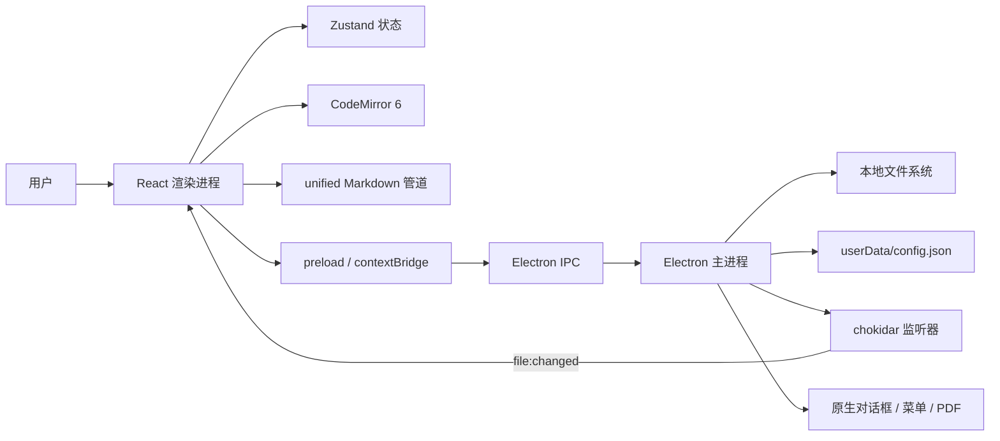
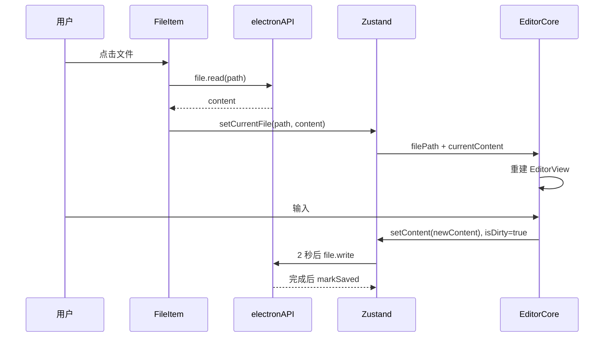

# md-manage 项目调研报告

> 调研日期：2026-08-03  
> 调研对象：`md-manage`（产品名“简记”）  
> 代码基线：`main@9295ac1`（`feat: ts`，2026-04-22）  
> 调研方式：源码与配置逐模块阅读、现有文档交叉核对、TypeScript 检查、Vitest、生产构建、CI 脚本复现、生产依赖审计  
> 结论口径：以当前仓库代码为准；规划文档和 README 仅作为设计意图参考

---

## 1. 执行摘要

`md-manage` 是一款以本地文件系统为数据源的 Electron Markdown 桌面应用。它采用 Electron 主进程负责文件、窗口、导入导出和配置，React 渲染进程负责文件树、CodeMirror 编辑器、Markdown 阅读器和设置界面，通过 preload 暴露的白名单 IPC API 通信。

项目的主体功能已经形成闭环：用户可以选择工作区、浏览和管理 `.md` 文件、编辑并自动保存、粘贴或拖入图片、切换阅读模式、搜索、导出 PDF/HTML。代码规模不大，模块边界清楚，类型检查、现有 16 项单元测试和生产构建均可通过，适合作为个人工具或原型继续迭代。

但当前版本不宜直接定义为“可靠的跨平台生产版本”。最需要优先处理的是：

1. **存在明确的数据丢失窗口**：自动保存倒计时期间切换文件或关闭应用，未保存内容可能直接丢失；重命名/拖拽移动遇到同名目标时，在部分平台上可能覆盖已有文件。
2. **主进程 IPC 缺乏工作区边界校验**：渲染进程可请求读取、写入、重命名或删除任意路径；同时主窗口关闭了 Electron sandbox 和 webSecurity，安全纵深不足。
3. **设置面板部分选项是“只保存、不生效”**：字体大小、Tab 宽度、自动保存开关、自动保存延迟未接入编辑器逻辑，也没有在打开设置时读取已保存值。
4. **跨平台承诺与实现不一致**：渲染层大量手工用 `/` 切路径，Windows 路径会出错；标准 Markdown 相对图片按工作区根目录解析，而不是按当前文档目录解析。
5. **CI 当前必定失败**：工作流调用了不存在的 `pnpm run build:renderer`。
6. **生产依赖存在已知漏洞**：`gray-matter -> js-yaml` 被 `pnpm audit --prod` 报告 1 个 high、1 个 moderate 的复杂度型 DoS 漏洞。

综合判断：**产品完成度约为“可用原型 / 内测版”，架构方向合理，但可靠性、安全性、跨平台和自动化质量门禁还未达到稳定发布标准。**

---

## 2. 项目范围与规模

### 2.1 仓库概况

| 指标 | 当前值 |
|---|---:|
| Git 跟踪文件 | 89 |
| TypeScript / TSX 文件（`src`、`electron`、`tests`） | 41 |
| CSS 文件 | 20 |
| `document` 下既有 Markdown 文档 | 7（本报告新增前） |
| 已跟踪 TypeScript、TSX、CSS、Markdown 行数 | 约 6,937 行（本报告新增前） |
| 生产构建 renderer 目录 | 约 2.4 MB |
| 生产构建 main 目录 | 约 40 KB |

### 2.2 产品定位

- 单用户、本地优先、无账号、无云同步、无数据库。
- 工作区就是用户选择的普通文件夹，用户可用 Finder/资源管理器直接管理文件。
- 应用内部只展示 Markdown 文件和目录，隐藏文件不会出现在文件树中。
- 图片资源统一保存到工作区的 `.md-manage/images/`。
- UI 由固定侧边栏、编辑/阅读主区域、设置弹层构成。

### 2.3 实际技术栈

| 层级 | 技术与版本（锁文件安装结果） |
|---|---|
| 桌面容器 | Electron 28.3.3 |
| 前端 | React 18.3.1、React DOM 18.3.1 |
| 构建 | Vite 5.4.21、vite-plugin-electron 0.28.8、TypeScript 5.9.3 |
| 编辑器 | CodeMirror 6 系列 |
| Markdown | unified、remark-parse、remark-gfm、remark-rehype、rehype-highlight、rehype-sanitize |
| Front Matter | gray-matter 4.0.3 |
| 状态管理 | Zustand 4.5.7、immer 10.2.0、persist middleware |
| 文件监听 | chokidar 5.0.0 |
| 测试 | Vitest 1.6.1 |
| 打包 | electron-builder 24.13.3 |

---

## 3. 总体架构



### 3.1 进程职责

**主进程（`electron/`）**

- 创建并恢复主窗口。
- 注册文件、工作区、配置、导入、右键菜单和窗口 IPC。
- 使用 Node 文件系统执行真实 I/O。
- 使用 chokidar 监听工作区变化。
- 使用隐藏 BrowserWindow 打印 PDF。
- 将窗口尺寸、位置、最大化和全屏状态持久化。

**preload（`electron/preload.ts`）**

- 在 `contextIsolation: true` 下，通过 `contextBridge` 暴露 `window.electronAPI`。
- API 按 file、workspace、config、image、export、import、contextMenu、window 分组。
- 封装主进程推送事件的订阅与取消订阅。

**渲染进程（`src/`）**

- `App.tsx` 负责全局主题、工作区恢复、文件变更监听、快捷键和总布局。
- `Sidebar` 负责文件树和文件操作。
- `EditorArea` / `EditorCore` 负责编辑及保存。
- `MarkdownRenderer` 负责阅读、搜索、图片放大与导出入口。
- Zustand 是跨组件内存状态中心，部分 UI 状态落 localStorage。

### 3.2 主要目录职责

| 路径 | 职责 | 评价 |
|---|---|---|
| `electron/main.ts` | 应用启动、窗口和 handler 注册 | 简洁，但安全选项偏宽松 |
| `electron/ipc/` | 文件、配置、导入、菜单、窗口 | 职责清楚，缺少统一校验层 |
| `src/components/sidebar/` | 文件树和 CRUD 交互 | 递归结构清楚，路径与未保存状态处理不足 |
| `src/components/editor/` | CodeMirror、搜索、自动保存 | 功能完整度高，保存一致性需加强 |
| `src/components/reader/` | 阅读、查找、导出、Lightbox | 结构清楚，图片路径语义有局限 |
| `src/components/settings/` | 设置和使用说明 | UI 已有，编辑器设置未真正生效 |
| `src/lib/` | Markdown、Front Matter、字数、快捷键 | 纯函数边界较好，测试只覆盖其中两项 |
| `src/stores/` | Zustand 全局状态 | 体量合适，持久化来源重复 |
| `src/workers/` | Markdown Worker | 当前没有接入，是死代码 |
| `tests/unit/` | Vitest 单测 | 仅覆盖 frontmatter 和 wordCount |

---

## 4. 核心业务流程

### 4.1 启动和工作区恢复

1. 主进程读取 `userData/config.json` 中的窗口状态并创建窗口。
2. 注册 IPC handler，随后读取 Electron 配置中的 `workspace` 并启动 chokidar。
3. React 挂载后再次调用 `workspace.get()`。
4. 若有路径，则写入 Zustand 并调用 `file.list()` 构建文件树。
5. 若无路径，侧边栏显示“尚未选择工作区”，用户手动点击选择。

实际行为与 README/需求文档存在差异：**首次启动不会自动弹出工作区选择框**，而是显示空状态等待用户操作。

### 4.2 文件树构建

`file:list` 调用主进程的递归 `listDir`：

- 跳过所有点号开头的文件和目录。
- 目录会递归进入，最大深度没有在 `listDir` 中限制。
- 只收录扩展名严格为小写 `.md` 的文件。
- 每层按 `modifiedAt` 降序排序。
- 文件夹也按目录自身 mtime 参与排序。

因此 `.MD`、`.Markdown` 和 `.markdown` 不会显示；README 所称“拖拽排序”实际上是“拖拽移动目录”，用户无法定义同级顺序，列表最终仍按修改时间排序。

### 4.3 打开与编辑文件



CodeMirror 在文件路径变化时销毁并重建，避免跨文件共享 undo 历史；同文件的外部 `body` 变化则整文替换。编辑功能包括 Markdown 高亮、软换行、行号、活动行、括号匹配、多选区、历史、查找替换和常用 Markdown 快捷键。

### 4.4 自动保存

- 内容变化后设置 `isDirty=true`。
- `EditorArea` 使用固定 2 秒 debounce。
- `Cmd/Ctrl+S` 清理计时器并立即保存。
- 切到阅读模式前，如果 dirty，也会立即保存。
- 保存成功只通过控制台和状态栏反馈；保存失败没有面向用户的错误提示。

当前自动保存没有事务版本或请求序号。如果一次旧内容写入仍在进行，用户又继续输入，旧请求完成时可能提前 `markSaved()`。更严重的是，切换文件会把 `isDirty` 直接重置并取消旧计时器。

### 4.5 图片粘贴与预览

1. CodeMirror 捕获 paste/drop 中的 image MIME。
2. 渲染进程把 Blob 转成 `number[]` 通过 IPC 发送。
3. 主进程按 `${Date.now()}.${ext}` 保存到 `.md-manage/images/`。
4. 编辑器插入 ``。
5. 阅读模式把非网络相对路径转为 `file://{workspace}/{src}`。
6. rehype-sanitize 清洗 HTML，阅读视图通过 `` 展示。

设计能覆盖应用自身生成的图片，但存在三点限制：

- 图片名仅使用毫秒时间戳，极端并发下可能碰撞并覆盖。
- 普通 Markdown 文档的相对图片应相对“文档所在目录”，当前统一相对“工作区根目录”。
- Windows drive 路径会被 `encodeURIComponent` 编码冒号，且渲染层路径拆分依赖 `/`，需真实 Windows 环境复测。

### 4.6 阅读与导出

阅读管道为：

`remarkParse -> remarkGfm -> remarkRehype -> 自定义图片路径 -> rehypeHighlight -> rehypeSanitize -> rehypeStringify`

优点：

- 支持 GFM 表格、任务列表和删除线。
- 对最终 HTML 做 sanitize，基本的 Markdown XSS 面有防护。
- 代码高亮、暗色样式、图片 Lightbox、阅读区查找均已实现。
- 查找使用 CSS Custom Highlight API，不改写阅读区 DOM。

导出时重新渲染 Markdown，并注入内联 CSS。HTML 直接写文件；PDF 则加载到隐藏窗口后调用 `printToPDF`。

注意：Front Matter 的 `title` 被直接拼接到导出 HTML 的 `<title>` 中，没有 HTML 转义。若标题含 `</title>` 等内容，导出文档结构可被注入；隐藏导出窗口也没有显式收紧 webPreferences。

---

## 5. 功能完成度矩阵

| 功能 | 状态 | 说明 |
|---|---|---|
| 选择/更换工作区 | 已实现 | 首次启动为手动选择，不是自动弹窗 |
| 递归文件树 | 已实现 | 只识别小写 `.md` |
| 新建文件 | 已实现 | 时间戳临时名，随后内联重命名 |
| 新建文件夹 | 已实现 | 通过写入隐藏 `.gitkeep` 间接建目录 |
| 重命名/删除 | 已实现但有风险 | 同名覆盖、文件夹内当前文件状态处理不足 |
| 拖拽 | 部分实现 | 只支持树内移动，不是任意排序；外部导入 API 未接 UI |
| 外部文件监听 | 部分实现 | 刷新文件树，不刷新当前编辑内容；目录事件被 `.md` 过滤 |
| Markdown 编辑 | 已实现 | CodeMirror 功能较全 |
| 自动/手动保存 | 已实现但不可靠 | 切换/关闭和并发写入存在一致性问题 |
| 编辑器查找替换 | 已实现 | 大小写、正则、逐项/全部替换 |
| 阅读模式 | 已实现 | GFM、代码高亮、sanitize |
| 阅读模式查找 | 已实现 | 依赖 Chromium CSS Highlight API |
| 图片粘贴/拖拽 | 已实现 | 路径语义和命名碰撞需修正 |
| PDF/HTML 导出 | 已实现 | 缺少错误反馈和标题转义 |
| 主题 | 基本实现 | auto 下 CodeMirror 不一定随系统变更实时重配 |
| 设置面板 | 部分实现 | 主题/工作区有效，编辑器设置不生效 |
| Front Matter | 部分实现 | 阅读标题会使用；编辑器没有独立标题/标签 UI |
| 文件/文件夹导入 | 后端已实现、UI 未接入 | preload 和 IPC 存在，但组件没有调用 |
| 窗口控制 API | 后端已实现、UI 未接入 | 当前主要依赖系统窗口框架 |
| Markdown Worker | 未接入 | 注释声称大文件使用 Worker，实际无调用 |
| KaTeX / Mermaid | 未实现 | 仅规划 |
| 版本历史 / Cmd+P | 已移除 | 旧需求文档仍有残留描述 |

---

## 6. 状态与数据存储

### 6.1 Zustand 状态

| 类别 | 字段 | 持久化 |
|---|---|---|
| 当前文档 | `currentFile`、`currentContent`、`isDirty` | 否 |
| 文件树 | `files` | 否 |
| 最近文件 | `recentFiles` | localStorage，但 UI 未使用 |
| UI | `viewMode`、`theme`、`sidebarVisible`、`settingsOpen` | 仅 theme/sidebarVisible |
| 工作区 | `workspace` | localStorage，同时 Electron config 也保存 |

工作区有两份持久化来源：localStorage 和 Electron `config.json`。启动时 Electron 配置优先，但双写会增加状态漂移可能。建议将文件系统相关配置统一放在主进程配置中，localStorage 只保存纯 UI 偏好。

### 6.2 文件系统布局

```text
<workspace>/
├── 用户 Markdown 文件与文件夹
└── .md-manage/
    └── images/
```

Electron 用户数据目录还保存：

```text
<Electron userData>/config.json
├── workspace
├── window
└── settings.editor.*
```

其中 `settings.editor.*` 当前只有写入，没有读取和应用。

---

## 7. IPC 与安全边界

### 7.1 IPC 清单与使用情况

| API | 主要用途 | 当前 UI 调用 |
|---|---|---|
| `file.read/write/delete/rename/list/create` | 文件 CRUD | 是 |
| `workspace.open/get/init` | 工作区 | open/get 是，init 未发现调用 |
| `config.get/set` | 配置 | set 被设置页调用，get 未用于编辑器设置 |
| `image.save/getAbsPath` | 图片 | save 是，getAbsPath 未发现调用 |
| `export.pdf/html` | 导出 | 是 |
| `import.files/folder/drop` | 导入 | 未发现组件调用 |
| `contextMenu.show` | 原生菜单 | 是 |
| `window.*` | 窗口控制 | 未发现组件调用 |
| `onFileChanged/onMenuAction` | 主进程事件 | 是 |

### 7.2 安全现状

正面措施：

- `nodeIntegration: false`。
- `contextIsolation: true`。
- preload 采用显式 API 白名单，而不是直接暴露 ipcRenderer。
- Markdown HTML 经 rehype-sanitize。
- 删除优先进入系统废纸篓。
- 新窗口被拦截并转到系统浏览器。

主要风险：

1. `sandbox: false`、`webSecurity: false` 降低 Electron 默认防护。
2. file IPC 接受渲染层传入的任意绝对路径，未验证其是否位于当前工作区。
3. `image:getAbsPath` 也未阻止 `../` 路径穿越。
4. `shell.openExternal(url)` 没有限制 `https/http` 协议；理论上可请求系统处理其他协议。
5. 配置 key/value 无 schema 校验。
6. PDF 导出窗口没有显式 `sandbox/contextIsolation/nodeIntegration` 配置和导航限制。
7. `file:delete` 在 trash 失败后会永久递归删除，UI 没有确认或不可恢复提示。

安全优先策略应是：**先建立工作区路径守卫，再恢复 sandbox/webSecurity，最后限制协议、导出窗口和配置 schema。**

---

## 8. 问题与风险清单

### 8.1 P0：发布前必须解决

#### P0-1 未保存内容可在切换文件或关闭应用时丢失

证据链：

- `EditorArea` 在内容变化后延迟 2 秒写盘。
- `FileItem.handleClick` 直接读取新文件并调用 `setCurrentFile`。
- `setCurrentFile` 会把 `isDirty` 设为 false。
- 旧保存 effect 在依赖变化时清理计时器。
- 应用关闭没有 beforeunload/close 协商保存。

复现场景：编辑文件 A 后 2 秒内点击文件 B，或立即关闭窗口。A 的新内容可能没有落盘。

建议：集中实现 `DocumentSession`/保存协调器；所有切换工作区、切换文件、重命名、移动、删除、关闭窗口都先调用可等待的 `flushSave()`。主进程关闭流程应通过 `before-quit` 或渲染层确认协议处理 dirty 状态。

#### P0-2 重命名/移动同名目标可能覆盖文件

主进程 `file:rename` 直接调用 `fs.rename(oldPath, newPath)`，没有冲突检测。在 POSIX 上，目标是已有文件时可能被替换。文件树移动同样复用该 API。

建议：主进程统一检查目标存在性，返回结构化冲突错误；由用户选择取消、改名或明确覆盖。禁止静默覆盖。

### 8.2 P1：高优先级

#### P1-1 IPC 没有工作区路径沙箱

只要渲染进程被利用，就可借 file API 访问工作区外任意文件。应对每个路径先 `resolve/realpath`，验证它位于当前 workspace；导入源路径可读，但目标路径必须在 workspace。符号链接也应纳入判断。

#### P1-2 Electron 安全配置过宽

主窗口同时使用 `sandbox: false` 和 `webSecurity: false`。建议采用自定义安全协议或 `protocol.handle` 提供本地图片，而不是全局关闭 webSecurity；重新开启 sandbox，并加 `will-navigate`、`setWindowOpenHandler` 的协议白名单。

#### P1-3 Windows 路径不可靠

`Sidebar`、`Folder`、`FileItem` 中大量使用 `lastIndexOf('/')`、`split('/')` 和字符串拼路径。Windows 主进程返回的路径通常使用 `\`，会导致活动目录、右键上下文目录、重命名和拖拽计算错误。

建议：路径运算全部移到主进程，渲染进程只传 path 和操作意图；或者通过 preload 提供受控的 dirname/basename/join 结果，避免在 UI 自行解析平台路径。

#### P1-4 外部修改同步不完整

chokidar 事件只触发文件树重载，不会重新读取当前文档。外部编辑同一文件时，屏幕仍显示旧内容，之后自动保存可能覆盖外部变更。应建立文件版本（mtime/hash）和冲突提示。

#### P1-5 生产依赖漏洞

`pnpm audit --prod` 报告：

- high：`GHSA-52cp-r559-cp3m`
- moderate：`GHSA-h67p-54hq-rp68`
- 路径：`gray-matter -> js-yaml`，受影响版本 `<3.15.0`

恶意或异常 Front Matter 可能造成高 CPU 消耗。建议升级/替换解析链，确认最终锁定 `js-yaml >= 3.15.0`，并补充超大/别名链 Front Matter 测试。

#### P1-6 CI 工作流必定失败

`.github/workflows/ci.yml` 最后执行 `pnpm run build:renderer`，但 `package.json` 没有该脚本。本次本地复现返回 `ERR_PNPM_NO_SCRIPT`。

建议：改为 `pnpm run build`；或者显式新增只构建 renderer 的脚本。CI 还应直接调用统一的 `build:check`，避免本地和 CI 命令漂移。

### 8.3 P2：中优先级

#### P2-1 编辑器设置是无效配置

设置页保存 fontSize、tabSize、autoSave、autoSaveDelay，但：

- 打开时使用硬编码 `defaultValue`，不读取配置；
- CodeMirror 字体和 Tab 仍写死；
- 自动保存始终开启且固定 2000ms。

这会造成明显的用户信任问题。应在设置模型、读取 hook 和编辑器 Compartment/保存逻辑间建立真实数据流；未接入前应隐藏这些控件。

#### P2-2 文件操作后当前路径可能失效

- 拖拽移动当前文件不会更新 `currentFile`。
- 移动/重命名包含当前文件的父文件夹不会批量替换路径前缀。
- 删除包含当前文件的文件夹只比较目录路径与 currentFile，不会清空子文件会话。
- `recentFiles` 不随重命名、移动或删除更新。

后果可能是后续保存到旧路径并重新创建已移动文件。

#### P2-3 `.markdown` 导入后不可见

导入对话框允许 `.markdown`，drop handler 也会复制 `.markdown`，但 `listDir` 和目录导入收集器只识别 `.md`。用户导入成功后在 UI 看不到文件。

#### P2-4 标准相对图片语义不兼容

`docs/a.md` 中的 `` 应解析为 `docs/images/x.png`，当前解析为 `<workspace>/images/x.png`。建议 `renderMarkdown` 接收 currentFile，使用文档 dirname 作为基准；应用自身 `.md-manage/...` 可作为工作区根相对的特殊策略。

#### P2-5 自动主题下 CodeMirror 不一定实时跟随系统

`App` 会监听系统主题并更新 `<html data-theme>`，但 `EditorArea` 的 `isDark` 只是 `useMemo` 读取 `matchMedia().matches`，没有系统主题 state。仓库已有 `useSystemTheme` hook，但未使用。

#### P2-6 导出 HTML 标题未转义

`wrapHtmlForExport` 将 Front Matter title 原样插入 `<title>`。需要使用 HTML escape，导出窗口还应禁用脚本并限制导航。

#### P2-7 错误只写控制台

读写、保存、导出、重命名、拖拽等失败大多 `console.error`，用户无法判断操作是否成功。应增加统一 toast/error dialog，并让保存状态显示“保存失败”。

### 8.4 P3：维护性与体验

- `src/workers/markdown.worker.ts` 没有接入，注释所称“大文件 >50KB 走 worker”并不存在。
- `useSystemTheme.ts`、若干 IPC、`WorkspaceInfo`/metadata、import UI 等属于未使用能力。
- 直接引入 `@codemirror/language-data` 的 `languages` 导致大量语言模块进入构建，主 renderer chunk 达 1,279.61 KB（gzip 396.65 KB）。
- Vite 构建提示 chunk 超过 500 KB。
- gray-matter 构建出现 `eval` 警告。
- Vite Node API CJS 构建已弃用，测试和构建均产生提示。
- `scripts/generate-icon.mjs` 导入了未使用的 `writeFile`。
- package 声明 MIT，但仓库没有独立 `LICENSE` 文件。
- `.gitignore` 的 `releaseelectron_mirror=...` 疑似把两行错误粘连；实际 `release/` 没被正确单独忽略。
- 模式淡入动画定义了 `.mode-enter`，组件未实际添加该 class。
- 设置“使用说明”仍写有“移至归档”，但归档功能已经移除。

---

## 9. 性能评估

### 9.1 当前优势

- 文件树、编辑器、阅读器模块均较轻量。
- Zustand 使用细粒度 selector，避免部分无关重渲染。
- Markdown 渲染 effect 有 cancelled 标志，避免过期 Promise 覆盖新结果。
- CodeMirror 适合长文本编辑，查找也使用其原生能力。
- chokidar 配置了 `awaitWriteFinish`，减少半写入事件。

### 9.2 潜在瓶颈

1. `listDir` 串行执行 `readdir -> stat -> recursion`，每次任何 `.md` 变化都会重扫整个工作区。
2. chokidar 的每个事件都会触发一次全树刷新，没有 debounce/coalescing。
3. 文件树一次性递归到所有目录；大量目录时启动和刷新成本高。
4. Markdown 阅读每次内容变化都在主线程重新解析和高亮；现有 Worker 未接入。
5. `highlight.js detect: true` 会对未标注语言的代码块做自动探测。
6. CodeMirror 引入全量 language-data，使初始包体偏大。
7. 图片通过 `number[]` IPC 传输，内存开销远大于原始二进制；大图会放大序列化成本。

建议先做真实基准：1,000/10,000 文件工作区、1/10/50 MB Markdown、10/50 MB 图片、连续外部写入。没有基准数据前，现有需求文档中的“启动 <3 秒、打开 <500ms、搜索 <50ms”只是目标，不是已验证指标。

---

## 10. 测试、构建与发布现状

### 10.1 本次实测结果

| 检查 | 命令 | 结果 |
|---|---|---|
| Renderer + Electron 类型检查 | `pnpm run build:check` | 通过 |
| 单元测试 | `pnpm exec vitest run --reporter=verbose` | 2 个文件、16 项全部通过 |
| 生产构建 | `pnpm run build` | 通过，renderer/main/preload 均产出 |
| CI 中的构建命令 | `pnpm run build:renderer` | 失败：脚本不存在 |
| 生产依赖审计 | `pnpm audit --prod` | 失败：1 high + 1 moderate |

### 10.2 当前测试覆盖边界

已覆盖：

- Front Matter 基本解析、序列化和空值过滤。
- 中英文混排字数、代码剔除和阅读时间。

未覆盖：

- 文件切换时自动保存、关闭前保存和保存竞态。
- 文件重命名、移动、冲突和删除。
- IPC 参数验证及工作区越界。
- Windows 路径。
- Markdown sanitize、图片路径、外链和导出。
- 组件交互、快捷键、设置生效。
- chokidar 外部修改冲突。
- Electron 端到端启动和打包安装。

当前测试通过只能证明两个工具模块的基础行为正确，不能代表核心文件管理与保存链路可靠。

### 10.3 打包配置

electron-builder 已配置：

- macOS：DMG、ZIP。
- Windows：NSIS。
- Linux：AppImage、deb。
- 构建资源和多尺寸图标齐全。

本次验证了 Vite 生产构建，没有执行完整安装包打包、签名、公证或三平台安装测试。当前也未配置 macOS notarization、Windows code signing、自动更新和 release workflow。

---

## 11. 文档一致性审查

现有文档能较好说明设计思路，但存在明显版本漂移：

| 文档表述 | 当前代码事实 |
|---|---|
| 首次启动自动弹出工作区 | 实际显示空状态，用户点击后才弹出 |
| Front Matter 有 TitleInput/TagEditor | 组件不存在，编辑器直接编辑完整原文 |
| 大文件走 Markdown Worker | Worker 文件存在但未接入 |
| 文件拖拽排序 | 实际只能拖拽移动目录，排序固定为 mtime |
| 设置可调整字体/Tab/自动保存 | 只写配置，不生效 |
| 外部修改自动刷新 | 只刷新树，不刷新当前内容 |
| `.markdown` 可导入 | 可复制但不会显示 |
| v0.2/v0.3/v0.4 功能状态 | package 和设置仍显示 0.1.0 |
| CI 执行构建 | 当前 CI 脚本名错误 |
| README 项目结构含 build 和 workflow | 基本存在，但若干功能状态被写得过满 |

建议把文档分成三类并显式标记：

- `README`：只写当前稳定可用行为。
- `ARCHITECTURE.md`：进程、状态、IPC、数据流和安全边界。
- `ROADMAP.md`：规划与未实现功能，每项有状态。

旧的功能拆解文档应加“历史设计稿”标识，避免新开发者误判。

---

## 12. 推荐改进路线

### 第一阶段：可靠性止血（建议 1 个迭代）

1. 实现统一保存协调器和 `flushSave()`。
2. 拦截切换文件、工作区、移动、重命名、删除、关闭窗口。
3. 文件移动/重命名增加目标冲突检测，禁止静默覆盖。
4. 修复当前文件及其父目录变更后的路径同步。
5. 修复 CI 脚本。
6. 升级存在漏洞的 YAML 依赖链。
7. 给保存和文件操作增加用户可见的错误提示。

验收标准：任何导致当前文档离开的操作都不会静默丢内容；同名文件不会被无提示覆盖；CI 全绿。

### 第二阶段：安全与跨平台（建议 1 个迭代）

1. 所有文件 IPC 增加 workspace containment 校验和 schema 校验。
2. 恢复 Electron sandbox/webSecurity，以自定义协议加载本地图片。
3. 限制外部链接为 `http:`/`https:`。
4. 路径运算移到主进程，补 Windows 测试。
5. 相对图片以 currentFile dirname 解析。
6. 收紧导出窗口并转义标题。

验收标准：渲染层无法访问工作区外路径；Windows 基础文件管理和图片链路通过端到端测试。

### 第三阶段：功能闭环与性能

1. 让编辑器设置真实生效，或删去无效选项。
2. 接入文件/文件夹导入 UI，并统一 `.md/.markdown` 规则。
3. 对外部修改做 mtime/hash 冲突检测。
4. 文件树增量刷新或按需展开加载。
5. 只加载常用 CodeMirror 语言，按需动态 import。
6. 大文档渲染真正接入 Worker，图片 IPC 改为更高效的数据传递。

### 第四阶段：发布工程化

1. 增加核心集成测试和 Electron E2E。
2. 建立三平台构建矩阵。
3. 添加签名、公证、版本发布和 changelog 流程。
4. 对启动、文件树、编辑、渲染建立可重复性能基准。
5. 补 `LICENSE`、架构文档和准确的版本号。

---

## 13. 建议的测试金字塔

| 层级 | 建议用例 |
|---|---|
| 纯函数单测 | Markdown sanitize、路径解析、冲突命名、title escape、配置校验 |
| Store/组件测试 | dirty 状态、切换前保存、设置加载、主题、搜索 |
| 主进程集成测试 | 临时工作区 CRUD、越界拒绝、符号链接、导入、监听 |
| Electron E2E | 首次启动、选工作区、编辑保存、切文件、关闭重开、导出 |
| 跨平台 E2E | macOS/Windows/Linux 路径、快捷键、菜单和安装包 |
| 性能回归 | 大量文件、大文档、大图、连续文件事件 |

核心回归用例至少应包括：

1. 输入后立即切文件，原文件内容仍落盘。
2. 输入后立即关闭并重启，内容仍存在。
3. 移动当前文件后继续保存，不会在旧位置重新创建。
4. 重命名到已有文件时明确阻止。
5. 删除当前文件的父目录后，会话正确关闭。
6. 恶意 `../`、绝对路径和符号链接无法越过工作区。
7. Windows 路径的 dirname/basename/join 正确。
8. 子目录 Markdown 的相对图片正确显示。
9. 外部修改当前文件时出现冲突提示而非静默覆盖。
10. 恶意 Front Matter 和 Markdown 不会执行脚本或拖垮界面。

---

## 14. 最终结论

该项目的优势是目标聚焦、技术选型合适、代码组织直观，文件管理—编辑—阅读—导出主流程已经可运行。对于个人学习项目，它已经具备较高的功能密度；对于准备长期维护的桌面产品，它也有一个可以继续演进的骨架。

当前最大的短板不是功能数量，而是**文档生命周期和数据安全**：应用将本地 Markdown 作为唯一真实数据源，因此任何保存竞态、路径错误或静默覆盖都会直接伤害用户资产。建议暂停继续叠加 KaTeX、Mermaid 等新功能，先完成保存一致性、路径边界、跨平台和 CI 修复。完成前两阶段后，项目才适合从“功能原型”升级为“可公开测试版本”。

按当前证据给出定性评价：

| 维度 | 评价 |
|---|---|
| 产品主流程 | 良好 |
| 代码可读性 | 良好 |
| 架构可演进性 | 中上 |
| 数据可靠性 | 较弱，存在 P0 |
| 安全边界 | 较弱 |
| 跨平台成熟度 | 较弱 |
| 自动化测试 | 基础级 |
| CI/CD | 当前不可用 |
| 文档完整度 | 丰富但漂移明显 |
| 发布准备度 | 内测原型，不建议直接稳定发布 |

---

## 附录 A：验证命令与结果摘要

```bash
pnpm run build:check
# 通过

pnpm exec vitest run --reporter=verbose
# 2 test files passed, 16 tests passed

pnpm run build
# 通过；renderer 主 chunk 1,279.61 kB，gzip 396.65 kB

pnpm run build:renderer
# 失败：ERR_PNPM_NO_SCRIPT

pnpm audit --prod
# 1 high, 1 moderate（gray-matter -> js-yaml）
```

## 附录 B：重点源码索引

- 应用启动与安全选项：`electron/main.ts`
- 文件、工作区、图片、导出：`electron/ipc/fileSystem.ts`
- 导入：`electron/ipc/import.ts`
- preload 契约：`electron/preload.ts`、`src/types/ipc.ts`
- 全局状态：`src/stores/appStore.ts`
- 全局编排：`src/App.tsx`
- 文件树：`src/components/sidebar/Sidebar.tsx`
- 自动保存：`src/components/editor/EditorArea.tsx`
- CodeMirror：`src/components/editor/EditorCore.tsx`、`EditorExtensions.ts`
- Markdown 渲染：`src/lib/markdown.ts`
- 阅读与导出：`src/components/reader/MarkdownRenderer.tsx`、`ExportBar.tsx`
- 设置：`src/components/settings/sections/index.tsx`
- CI：`.github/workflows/ci.yml`
